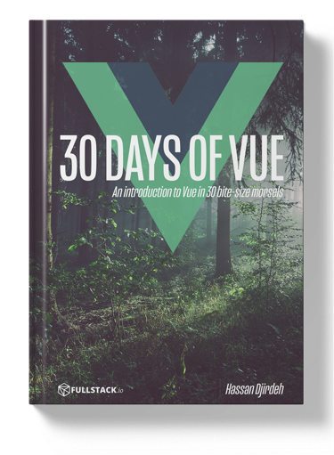
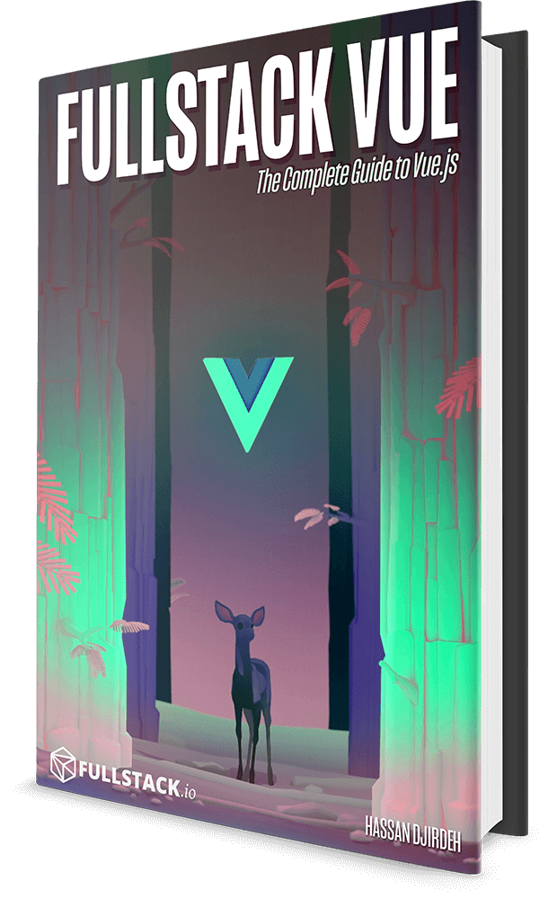

<p align="center">
  
</p>
<h3 align="center">
  ✨ 30 Days of Vue ✨
</h3>
<p align="center">
  An Introduction to Vue - in 30 Bite-Size Morsels. Written by the authors of <a href="https://fullstack.io/vue">Fullstack Vue</a></a>
</p>
<p align="center">
  <a href="https://fullstack.io/30-days-of-vue">
    
  </a>
</p>

# 🚀 Introduction

Over the next 30 days, we'll walk through everything you need to know to work with Vue. From the very beginning through topics like the Vue Instance, Components, and even Testing.

This repository contains the entire source and content for the article series of [30 Days of Vue](https://www.fullstack.io/30-days-of-vue) hosted by the [Fullstack Vue](https://fullstack.io/vue) team.

## 👀 What's inside?

<!-- prettier-ignore -->
|  <a align='center' href='./day-01'></a><h4 align='center'><a href='./day-01'>What is Vue?</a><h4> | <a href='./day-02'></a><h4 align='center'><a href='./day-02'>Data</a><h4> | <a href='./day-03'></a><h4 align='center'><a href='./day-03'>Data Driven Apps</a><h4> | <a href='./day-04'></a><h4 align='center'><a href='./day-04'>Vue Directives</a><h4> | <a href='./day-05'></a><h4 align='center'><a href='./day-05'>List Rendering</a><h4>  |
|:-:|:-:|---|---|---|
|  <a href='./day-06'></a><h4 align='center'><a href='./day-06'>Form Handling</a><h4> | <a href='./day-07'></a><h4 align='center'><a href='./day-07'>Vue Devtools</a><h4>  | <a href='./day-08'></a><h4 align='center'><a href='./day-08'>Computed Properties</a><h4>  | <a href='./day-09'></a><h4 align='center'><a href='./day-09'>Watchers</a><h4>  | <a href='./day-10'></a><h4 align='center'><a href='./day-10'>Lifecycle Hooks</a><h4>  |
|  <a href='./day-11'></a><h4 align='center'><a href='./day-11'>Global Components</a><h4> | <a href='./day-12'></a><h4 align='center'><a href='./day-12'>Props</a><h4> | <a href='./day-13'></a><h4 align='center'><a href='./day-13'>Custom Events</a><h4>  | <a href='./day-14'></a><h4 align='center'><a href='./day-14'>Component Details</a><h4>  | <a href='./day-15'></a><h4 align='center'><a href='./day-15'>Template Definitions</a><h4>  |
|  <a href='./day-16'></a><h4 align='center'><a href='./day-16'>Render Functions</a><h4> | <a href='./day-17'></a><h4 align='center'><a href='./day-17'>Single File Components</a><h4>  | <a href='./day-18'></a><h4 align='center'><a href='./day-18'>Vue CLI</a><h4>  | <a href='./day-19'></a><h4 align='center'><a href='./day-19'>EventBus</a><h4>  | <a href='./day-20'></a><h4 align='center'><a href='./day-20'>Simple Global Store</a><h4>  |
|  <a href='./day-21'></a><h4 align='center'><a href='./day-21'>Intro to Flux</a><h4> | <a href='./day-22'></a><h4 align='center'><a href='./day-22'>Vuex</a><h4>  | <a href='./day-23'></a><h4 align='center'><a href='./day-23'>Intro to Routing</a><h4>  | <a href='./day-24'></a><h4 align='center'><a href='./day-24'>Vue Router</a><h4>  | <a href='./day-25'></a><h4 align='center'><a href='./day-25'>Intro to Testing</a><h4>  |
|  <a href='./day-26'></a><h4 align='center'><a href='./day-26'>Implementing Tests</a><h4> | <a href='./day-27'></a><h4 align='center'><a href='./day-27'>Testing the App</a><h4> | <a href='./day-28'></a><h4 align='center'><a href='./day-28'>Vue Test Utils</a><h4>  | <a href='./day-29'></a><h4 align='center'><a href='./day-29'>Vue 3.0</a><h4>  | <a href='./day-30'></a><h4 align='center'><a href='./day-30'>Wrap-up</a><h4>  |

## 👩‍🏫 How to use this repository

Each day contains either contains a full Vue application or code samples that build up to the full app, following the same procedure used to create the article series. Most days can be run using the same basic steps (and for the days that require a bit more work, check out the tutorial series on the blog).

The steps to run standalone Vue applications:

```bash
Open the `index.html` file in your favourite browser.
```

The steps to run Webpack based Vue applications:

```bash
# install the dependencies
yarn install

# serve the project
yarn serve
```

## Contributors

<!-- ALL-CONTRIBUTORS-LIST:START - Do not remove or modify this section -->
<!-- prettier-ignore -->
| <a href='https://twitter.com/djirdehh'><h4 align='center'><a href='https://twitter.com/djirdehh'>Hassan Djirdeh</a></h4> | <a href='https://newline.co'><h4 align='center'><a href='https://newline.co'>Nate Murray</a></h4> |
| :---: | :---: |

<!-- ALL-CONTRIBUTORS-LIST:END -->

# Fullstack Vue Book

<a href="https://fullstack.io/vue">
  
</a>

This repo was written and is maintained by the [Fullstack Vue](https://fullstack.io/vue) team. In the book we cover many more projects like this. We walk through each line of code, explain why it's there and how it works.

_30 Days of Vue_ covers only the early basics of Vue. If you're looking to learn how to build real-world Vue apps, including libraries from the Vue ecosystem, there's no faster way than by spending a few hours with the Fullstack Vue book.
