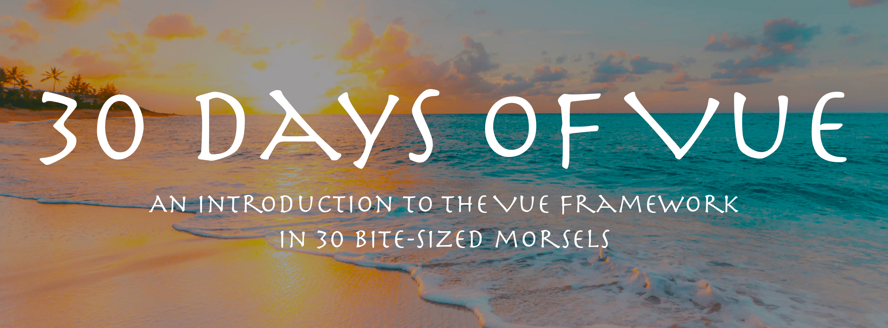
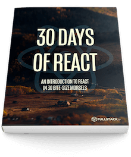

<hr />
<h1 align="center">
  30 Days of Vue
</h1>
<p align="center">

</p>
<h2 align="center">
  ✨ An Introduction to Vue - <b>in 30 Bite-Size Morsels</b> ✨
</h2>
<p align="center">
  Written by the authors of <a href="https://fullstack.io/vue">Fullstack Vue</a></a>
</p>
<p align="center">
<a href="https://app.monstercampaigns.com/c/opsh28ygz42xhvtlq4vd/">
  
</a>
</p>
<hr />

# 🚀 Introduction

Over the next 30 days, we'll walk through everything you need to know to work with Vue. From the very beginning through topics like the Vue Instance, Components, and even Testing.

This repository contains the entire source and content for the article series of [30 Days of Vue](https://www.fullstack.io/vue/30-days-of-vue) hosted by the [Fullstack Vue](https://fullstack.io/vue) team.

## 👀 What's inside?

<!-- prettier-ignore -->
| <a href='./day-01'></a><h4 align='center'><a href='./day-01'>What is React?</a><h4> | <a href='./day-02'></a><h4 align='center'><a href='./day-02'>What is JSX?</a><h4> | <a href='./day-03'></a><h4 align='center'><a href='./day-03'>Our First Components</a><h4> | <a href='./day-04'></a><h4 align='center'><a href='./day-04'>Complex Components</a><h4> | <a href='./day-05'></a><h4 align='center'><a href='./day-05'>Data-Driven</a><h4> |
| <a href='./day-06'></a><h4 align='center'><a href='./day-06'>State</a><h4> | <a href='./day-07'></a><h4 align='center'><a href='./day-07'>Lifecycle Hooks</a><h4> | <a href='./day-08'></a><h4 align='center'><a href='./day-08'>Packaging and PropTypes</a><h4> | <a href='./day-09'></a><h4 align='center'><a href='./day-09'>Styles</a><h4> | <a href='./day-10'></a><h4 align='center'><a href='./day-10'>Interactivity</a><h4> |
| <a href='./day-11'></a><h4 align='center'><a href='./day-11'>Pure Components</a><h4> | <a href='./day-12'></a><h4 align='center'><a href='./day-12'>create-react-app</a><h4> | <a href='./day-13'></a><h4 align='center'><a href='./day-13'>Repeating Elements</a><h4> | <a href='./day-14'></a><h4 align='center'><a href='./day-14'>Fetching Remote Data</a><h4> | <a href='./day-15'></a><h4 align='center'><a href='./day-15'>Introduction to Promises</a><h4> |
| <a href='./day-16'></a><h4 align='center'><a href='./day-16'>Displaying Remote Data</a><h4> | <a href='./day-17'></a><h4 align='center'><a href='./day-17'>Client-side Routing</a><h4> | <a href='./day-18'></a><h4 align='center'><a href='./day-18'>Introduction to Flux</a><h4> | <a href='./day-19'></a><h4 align='center'><a href='./day-19'>Data Management with Redux</a><h4> | <a href='./day-20'></a><h4 align='center'><a href='./day-20'>Redux actions</a><h4> |
| <a href='./day-21'></a><h4 align='center'><a href='./day-21'>Redux Middleware</a><h4> | <a href='./day-22'></a><h4 align='center'><a href='./day-22'>Introduction to Testing</a><h4> | <a href='./day-23'></a><h4 align='center'><a href='./day-23'>Implementing Tests</a><h4> | <a href='./day-24'></a><h4 align='center'><a href='./day-24'>Testing the App</a><h4> | <a href='./day-25'></a><h4 align='center'><a href='./day-25'>Better Testing with Enzyme</a><h4> |
| <a href='./day-26'></a><h4 align='center'><a href='./day-26'>Integration Testing</a><h4> | <a href='./day-27'></a><h4 align='center'><a href='./day-27'>Deployment Introduction</a><h4> | <a href='./day-28'></a><h4 align='center'><a href='./day-28'>Deployment</a><h4> | <a href='./day-29'></a><h4 align='center'><a href='./day-29'>Continuous Integration</a><h4> | <a href='./day-30'></a><h4 align='center'><a href='./day-30'>Wrap-up and More Resources</a><h4> |
| :---: | :---: | :---: | :---: | :---: |

## 👩‍🏫 How to use this repository

Each day contains either contains a full Vue application or code samples that build up to the full app, following the same procedure used to create the article series. Most days can be run using the same basic steps (and for the days that require a bit more work, check out the tutorial series on the blog).

The steps to run any _30 Days of Vue_ project are:

```bash
# install the dependencies
yarn install

# start the project
yarn start
```

Since all of the days are built using the fantastic [vue-cli](https://cli.vuejs.org/) tool, all of the commands are available from that project in every day.

## Contributors

<!-- ALL-CONTRIBUTORS-LIST:START - Do not remove or modify this section -->
<!-- prettier-ignore -->
| <a href='https://twitter.com/djirdehh'><h4 align='center'><a href='https://twitter.com/djirdehh'>Hassan Djirdeh</a></h4> | <a href='https://newline.co'><h4 align='center'><a href='https://newline.co'>Nate Murray</a></h4> |
| :---: | :---: |

<!-- ALL-CONTRIBUTORS-LIST:END -->

---

# Fullstack Vue Book

<a href="https://fullstack.io/vue">
  
</a>

This repo was written and is maintained by the [Fullstack Vue](https://fullstack.io/vue) team. In the book we cover many more projects like this. We walk through each line of code, explain why it's there and how it works.

_30 Days of Vue_ covers only the early basics of Vue. If you're looking to learn how to build real-world Vue apps, including libraries from the Vue ecosystem, there's no faster way than by spending a few hours with the Fullstack Vue book.

<div style="clear:both"></div>
