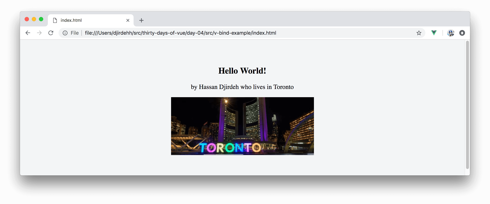
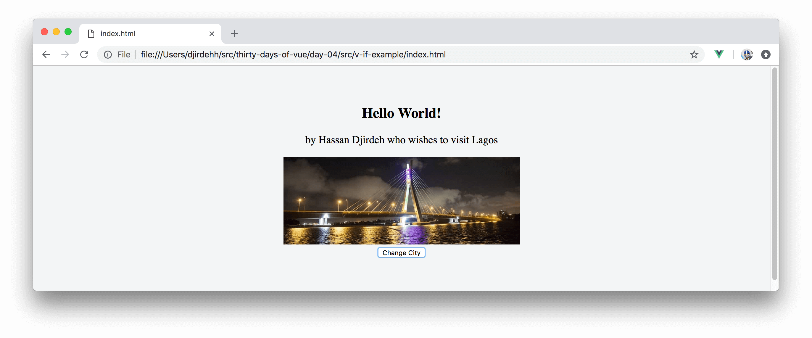

# Vue Directives

The last article was a little heavy on discussion. In this article, we’ll dive into more code examples by addressing some important native **directives**.

A **Vue directive** is essentially a special type of command that can be added to HTML content and often appears as a prefixed HTML attribute. We’ll first revisit the **v-on** directive since we’ve used it in one of the earlier articles.

## Event Handling with v-on

The [**v-on**](https://vuejs.org/v2/guide/events.html) directive can be used to create event listeners within the DOM to enable us to do something when a particular event happens.

In article **#2**, the **v-on** directive was used to call an instance `changeGreeting()` method when a button was clicked:

```html
<button v-on:click="changeGreeting">Change Greeting</button>
```

Instead of triggering a method in the instance, we’re also able to run JavaScript _inline_ in the template:

```html
<button v-on:click="greeting = 'Hi there!'">Change Greeting</button>
```

Though inline JavaScript works just as well, calling methods bound to the instance is often preferable when intended functionality change gets more complicated.

It's important to keep in mind that the **v-on** directive can be used with virtually any native DOM event:

```html
<h1 v-on:click="method">Click me!</h1>
<h1 v-on:dblclick="method">Double Click me!</h1>
<input v-on:keydown="method" placeholder="Press down on keys" />
<input v-on:keyup="method" placeholder="Release keys" />
<form v-on:submit="method">...</form>
<!-- ... -->
```

Here’s a code sample that shows some different event listeners with different expected outcomes:

### HTML

```html
<html>
  <head>
    <link rel="stylesheet" href="./styles.css" />
  </head>

  <body>
    <div id="app">
      <h2>{{ greeting }}</h2>
      <p>by {{ user }} who lives in {{ city }}</p>
      <button v-on:click="changeGreeting">
        Change Greeting
      </button> 
      <button v-on:dblclick="changeGreeting">
        Double click to change greeting
      </button>
      <input v-on:keyup="consoleGreeting"
             placeholder="Type anything and check the console." />
      <input v-on:keyup.enter="consoleEnterGreeting" 
             placeholder="Release the enter key and check the console." />
    </div>
    <script src="https://unpkg.com/vue"></script>
    <script src="./main.js"></script>
  </body>
</html>
```

### JS

```javascript
new Vue({
  el: '#app',
  data: {
    greeting: 'Hello World!',
    user: 'Hassan Djirdeh',
    city: 'Toronto'
  },
  methods: {
    changeGreeting() {
      this.greeting = this.greeting === 'Hello World!' ?
       'What is up!' :
       'Hello World!';
    },
    consoleGreeting() {
      console.log("You're typing something!");
    },
    consoleEnterGreeting() {
      console.log("Enter has been released!");
    },
  }
});
```

**TODO - Show v-on-example app - not image**


From the code sample above, you may have noticed the `v-on` directive be used on a `keyup.enter` event. `keyup.enter` is one of the [unique key modifiers](https://vuejs.org/v2/guide/events.html#Key-Modifiers) Vue provides to allow us to react to events from commonly used keys like the enter key.

Finally, event handlers usually have an event object that contains details about the event. In the **v-on** directive, we’re able to access this original event object by explicitly passing in the `$event` variable:

```html
<h1 v-on:click="method($event)">Click me!</h1>
```

The **v-on** directive is essentially what we use to detect and handle events in Vue applications.

## Attribute binding with v-bind

The simplest form of data binding in Vue is the Mustache Syntax (i.e. double curly braces) which is used to bind data values on to _text content_ of HTML elements.

In the code samples prepared in the first and second articles, we used the Mustache Syntax to bind `greeting`, `user`, and `city` properties defined in our instance on to the template:

```html
<html>
  <body>
    <div id="app">
      <h2>{{ greeting }}</h2>
      <p>by {{ user }} who lives in {{city}}</p>
    </div>
    <script src="https://unpkg.com/vue"></script>
    <script src="./main.js"></script>
  </body>
</html>
```

**We’re unable to use the Mustache syntax to bind data to standard HTML attributes like `href`, `id`, `src`, etc**. To bind HTML attributes, Vue provides the native [**v-bind**](https://vuejs.org/v2/guide/syntax.html#Attributes) directive.

Here’s an example of using the **v-bind** directive to bind a data property (named `cityImage`) to the `src` attribute of an `img` element:

### HTML

```html
<html>
  <head>
    <link rel="stylesheet" href="./styles.css" />
  </head>

  <body>
    <div id="app">
      <h2>{{ greeting }}</h2>
      <p>by {{ user }} who lives in {{ city }}</p>
      
    </div>
    <script src="https://unpkg.com/vue"></script>
    <script src="./main.js"></script>
  </body>
</html>
```

### JS

```javascript
new Vue({
  el: '#app',
  data: {
    greeting: 'Hello World!',
    user: 'Hassan Djirdeh',
    city: 'Toronto',
    cityImage: 'https://s3-us-west-2.amazonaws.com/s.cdpn.io/1211695/tdot.jpg'
  }
});
```

With the `cityImage` appropriately bound, we’ll be presented with a view of Toronto’s skyline:

**TODO - Show v-bind-example app - not image**



## Conditional rendering with v-if (or v-show)

Oftentimes, we may find ourselves interested in conditionally rendering content based on the value of an expression. In Vue, we can achieve this with the help of the [**v-if**](https://vuejs.org/v2/guide/conditional.html#v-if) and [**v-show**](https://vuejs.org/v2/guide/conditional.html#v-show) directives.

To see an example of conditional rendering, let’s first add a button to our previous example that would allow us to change the city title and image from Toronto to Lagos:

### HTML

```html
<html>
  <body>
    <div id="app">
      <h2>{{ greeting }}</h2>
      <p>by {{ user }} who lives in {{ city }}</p>
      
      <button v-on:click="changeCity">Change City</button>
    </div>
    <script src="https://unpkg.com/vue"></script>
    <script src="./main.js"></script>
  </body>
</html>
```

### JS

```javascript
new Vue({
  el: '#app',
  data: {
    greeting: 'Hello World!',
    user: 'Hassan Djirdeh',
    city: 'Toronto',
    cityImage: 'https://s3-us-west-2.amazonaws.com/s.cdpn.io/1211695/tdot.jpg'
  },
  methods: {
    changeCity() {
      if (this.city === 'Toronto') {
        this.city = 'Lagos';
        this.cityImage
          = 'https://s3-us-west-2.amazonaws.com/s.cdpn.io/1211695/lagos.jpg';
      } else {
      	this.city = 'Toronto';
        this.cityImage
          = 'https://s3-us-west-2.amazonaws.com/s.cdpn.io/1211695/tdot.jpg';
      }
    }
  }
});
```

The `changeCity()` method first checks if the `city` data value is `'Toronto'`, if so - it changes the `city` to `'Lagos'` and the `cityImage` to a hosted image of the Lekki-Ikoyi Link Bridge in Lagos state. If the city information has been already been changed, the `changeCity()` information simply reverts the information back to Toronto.

If we wanted to render some content in _certain conditions_ (e.g. when `city === 'Toronto'`), the **v-if** or **v-show** directive would prove useful. Since I (Hassan) live in Toronto, we can change the text content in the template to better reflect my presence. For example, we’ll use two separate `<p>` tags each containing a **v-if** directive to display the appropriate description text content:

```html
<html>
  <head>
    <link rel="stylesheet" href="./styles.css" />
  </head>

  <body>
    <div id="app">
      <h2>{{ greeting }}</h2>
      <p v-if="city === 'Toronto'">by {{ user }} who lives in {{ city }}</p>
      <p v-if="city === 'Lagos'">by {{ user }} who wishes to visit {{ city }}</p>
      
      <button v-on:click="changeCity">Change City</button>
    </div>
    <script src="https://unpkg.com/vue"></script>
    <script src="./main.js"></script>
  </body>
</html>
```

The text content of the first `<p>` tag that says `by Hassan who lives in Toronto` will only render if the `city` property is equal to `Toronto`. If `city` is equal to `Lagos`, the second `<p>` tag will instead only be displayed and say `by Hassan who wishes to visit Lagos`:

**TODO - Show v-if-example app - not image**



I> Vue also provides the [**v-else**](https://vuejs.org/v2/guide/conditional.html#v-else) directive to describe an else block and the [**v-else-if**](https://vuejs.org/v2/guide/conditional.html#v-else-if) directive to describe an else-if-block.

Instead of the **v-if** directive, we could also use the **v-show** directive to conditionally render content:

```html
<html>
  <head>
    <link rel="stylesheet" href="./styles.css" />
  </head>

  <body>
    <div id="app">
      <h2>{{ greeting }}</h2>
      <p v-show="city === 'Toronto'">by {{ user }} who lives in {{ city }}</p>
      <p v-show="city === 'Lagos'">by {{ user }} who wishes to visit {{ city }}</p>
      
      <button v-on:click="changeCity">Change City</button>
    </div>
    <script src="https://unpkg.com/vue"></script>
    <script src="./main.js"></script>
  </body>
</html>
```

**TODO - Show v-show-example app - not image**


Though they achieve a similar outcome, the **v-if** and **v-show** directives differ from one another. The **v-if** directive **does not render the element** only until the stated condition is `true`. The **v-show** directive always renders the element _but_ controls the CSS display property depending on whether the stated condition is `true`.

The **v-if** directive is usually preferred as long as you don’t need the element to always be present in the DOM **and** you don’t expect the toggling between displaying/hiding the element to happen very often. If we expect the element to toggle often at runtime - the **v-show** directive would be more appropriate.

## Shorthand syntax with v-on and v-bind

Vue provides shorthand syntax only for the commonly used **v-bind** and **v-on** directives. The **v-bind** directive can be shortened with the **:** symbol:

```html
<!-- the full syntax -->


<!-- the shorthand syntax -->

```

And the **v-on** directive can be shortened with the **@** symbol:

```html
<!-- the full syntax -->
<button v-on:click="methodName"></button>

<!-- the shorthand syntax -->
<button @click="methodName"></button>
```

The shorthand syntax is entirely optional and achieves the exact same outcome. Throughout the rest of this course, we’ll stick with using the shorthand syntax.

Awesome! We'll stop here for today. In the next article, we’ll spend some time discussing how the **v-for** directive can be used to help render lists of elements.
