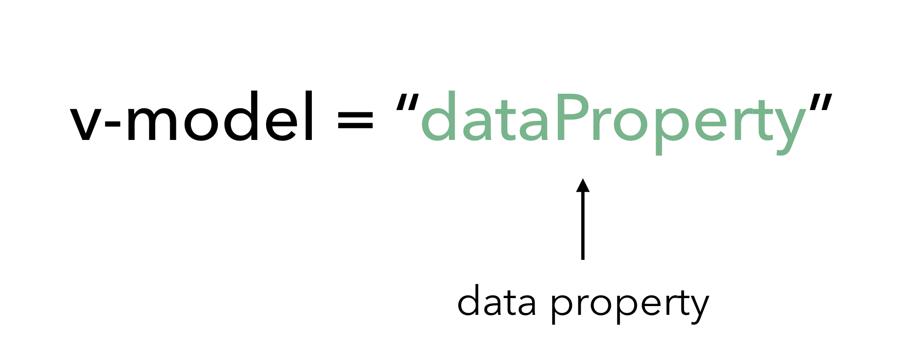
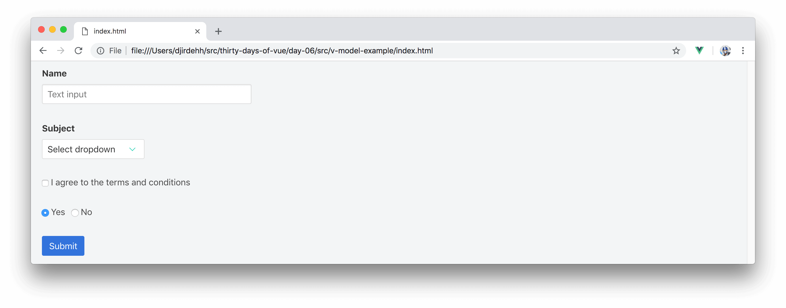
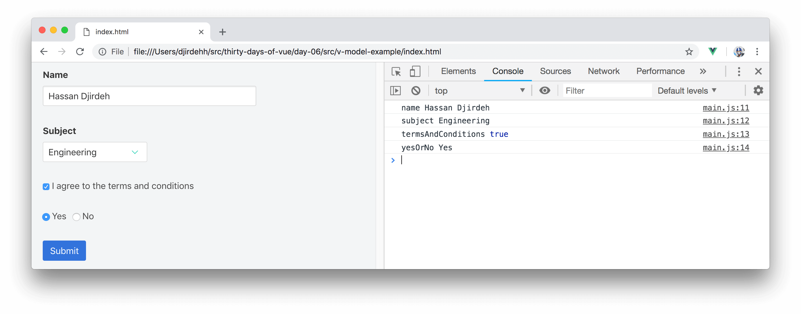

# Form Handling with v-model

> In yesterday’s article, we discussed the **v-for** directive and its role in helping display lists of elements. Today, we’ll spend a little time taking a look at the **v-model** directive and its ability to create two-way data binding.

## v-model

The [**v-model**](https://vuejs.org/v2/guide/forms.html) directive creates two-way data binding between form inputs and text area elements. In other words, **v-model** directly binds user input with a Vue object’s data model that as one changes, the other automatically gets updated.

The **v-model** directive syntax takes an expression which is the name of the data property that the input is bound to:



**v-model** removes any difficulty in keeping user input and the data model in sync and can be applied to virtually any form input element:

-   Text Inputs
-   Dropdowns
-   Checkboxes
-   Radio Inputs
-   etc…

Let’s see the **v-model** directive in action. For today's article, we’ll be setting up a form that contains a series of different inputs:



The form will contain a text input field to capture the user’s `name`, a dropdown for the user to select a `subject`, a checkbox to verify if the user has approved `termsAndConditions`, radio inputs to determine if the user has selected `yesOrNo`, and a Submit button.

Vue requires us to initialize any properties we intend to use in our application, so we’ll initialize the properties that are to be used in our form with empty/initial values. We’ll also set up a `submit()` instance method that will console log the values of each of these properties.

```javascript
new Vue({
  el: '#app',
  data: {
    name: '',
    subject: '',
    termsAndConditions: false,
    yesOrNo: 'No'
  },
  methods: {
    submit() {
      console.log('name', this.name);
      console.log('subject', this.subject);
      console.log(
        'termsAndConditions',
        this.termsAndConditions
      );
      console.log('yesOrNo', this.yesOrNo);
    }
  }
});
```

In the code sample above, notice how the properties in `data` are initialized differently depending on the form input that we expect the property to be used with?

-   We want the `name` and `subject` fields to be rendered with values of an empty string.
-   `termsAndConditions` will be bound to a checkbox. HTML checkbox elements traditionally have a boolean value unless otherwise specified. We’ve initialized `termsAndConditions` with `false` since we expect the checkbox to be rendered in the unchecked (i.e. `false`) state.
-   Radio inputs are often arranged in groups with each input usually given a unique value. We’ve initialized the `yesOrNo` property that would be used in our radio inputs with a string value of `'No'`.

We'll now create the template and use the **v-model** directive to bind the appropriate data properties to their respective input elements. We’ll also attach a listener to the submit button to call an instance `submit()` method when clicked. This makes our entire template look like the following:

```html
<html>
  <head>
    <link rel="stylesheet" href="./styles.css" />
    <link rel="stylesheet"
      href="https://unpkg.com/bulma/css/bulma.css" />
  </head>

  <body>
    <div id="app">
      <div class="field">
        <label class="label">Name</label>
        <input v-model="name"
          class="input"
          type="text"
          placeholder="Text input" />
      </div>

      <div class="field">
        <label class="label">Subject</label>
        <div class="select">
          <select v-model="subject">
            <option disabled value="">
              Select dropdown
            </option>
            <option>Engineering</option>
            <option>Computer Science</option>
            <option>Biology</option>
            <option>Other...</option>
          </select>
        </div>
      </div>

      <div class="field">
        <label class="checkbox">
          <input v-model="termsAndConditions"
            type="checkbox" />
          I agree to the terms and conditions
        </label>
      </div>

      <div class="field">
        <label class="radio">
          <input v-model="yesOrNo"
            type="radio"
            value="Yes" />
          Yes
        </label>
        <label class="radio"> 
          <input v-model="yesOrNo"
            type="radio"
            value="No" />
          No
        </label>
      </div>

      <div class="field">
        <button class="button is-info" @click="submit">
          Submit
        </button>
      </div>
    </div>
    <script src="https://unpkg.com/vue"></script>
    <script src="./main.js"></script>
  </body>
</html>
```

In the template, we've introduced a local `styles.css` file like we've done before but we've also included the [Bulma CSS](https://bulma.io/documentation/) framework into our application from a CDN.

I> [Bulma](https://bulma.io/documentation/) is a CSS framework, much like Twitter’s popular [Bootstrap](http://getbootstrap.com/) framework. It provides us with a grid system and some simple styling. Though we'll be using Bulma from time to time, we won’t need to know Bulma in-depth to go through this article or the rest of the course.

Let’s break down what each of the field elements in the template contain.

For every keystroke made in the 'Name' text input field, the **v-model** directive will bind the value of this input field to the `name` data property.

```html
      <div class="field">
        <label class="label">Name</label>
        <input v-model="name"
          class="input"
          type="text"
          placeholder="Text input" />
      </div>
```

For every option selected in the 'Subject' dropdown, **v-model** will bind the value of the option selected to the `subject` data property. We’ve set a value of an empty string (which is also the initial value of the `subject` property) to the first disabled option as to have it selected when the application first renders.

```html
      <div class="field">
        <label class="label">Subject</label>
        <div class="select">
          <select v-model="subject">
            <option disabled value="">
              Select dropdown
            </option>
            <option>Engineering</option>
            <option>Computer Science</option>
            <option>Biology</option>
            <option>Other...</option>
          </select>
        </div>
      </div>
```

Checkbox inputs naturally have a boolean value which dictates whether the checkbox is checked or unchecked. Our `termsAndConditions` property is initialized with `false` and bound directly to the checkbox input.

```html
      <div class="field">
        <label class="checkbox">
          <input v-model="termsAndConditions"
            type="checkbox" />
          I agree to the terms and conditions
        </label>
      </div>
```

Finally, since radio inputs usually have custom values specified with them, we’ve set the expected values for each radio input alongside the **v-model** directive.

```html
      <div class="field">
        <label class="radio">
          <input v-model="yesOrNo"
            type="radio"
            value="Yes" />
          Yes
        </label>
        <label class="radio"> 
          <input v-model="yesOrNo"
            type="radio"
            value="No" />
          No
        </label>
      </div>
```

We can now go ahead and test our application. If we populate our form, click the Submit button, and check the developer console - we’ll be able to see the values of each of the data attributes within our instance.

<iframe src='./src/v-model-example/index.html'
        height="375"
        scrolling="no"
         >
</iframe>

Here’s a sample expected response:



It’s important to keep in mind that when using the **v-model** directive - **v-model** takes the **data property of the Vue instance as the single source of truth** as opposed to HTML element attributes like `checked` or `selected`.

Oftentimes we would probably find ourselves using the **v-model** directive in the simplest possible way but there are ways to create unique value bindings and modifiers in certain cases. Be sure to check out the [Form Input Bindings - Value Bindings](https://vuejs.org/v2/guide/forms.html#Value-Bindings) and [Form Input Bindings - Modifiers](https://vuejs.org/v2/guide/forms.html#Modifiers) sections of the Vue documentation if you're interested in seeing how some of these unique bindings/modifiers can be applied.

## Two-way data binding

Though the v-model directive creates _two-way_ data binding, we haven’t really been able to see the two-way binding in the application we've built in this article. We could witness this by creating functionality that changes the values of the `data` properties being used in the form and verifying that our template updates (i.e. re-renders) to show the new values.

A simpler way we can witness **v-model**'s two-way data binding is by using the [Vue Devtools](https://github.com/vuejs/vue-devtools) - a browser dev tools extension built and maintained by the Vue core team. Vue Devtools provides incredibly useful capabilities in debugging Vue applications and we’re going to spend the next article discussing it!

Until tomorrow!
