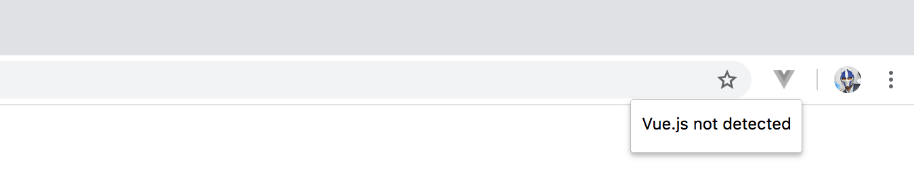
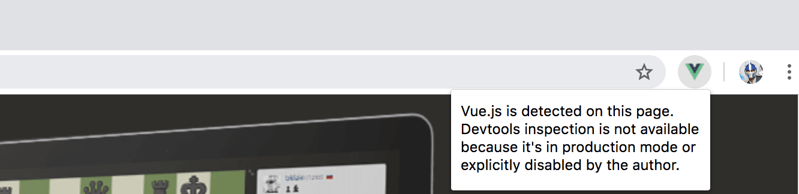
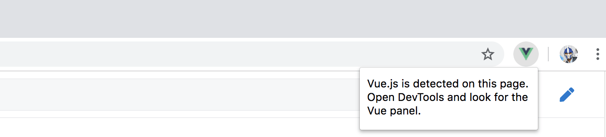
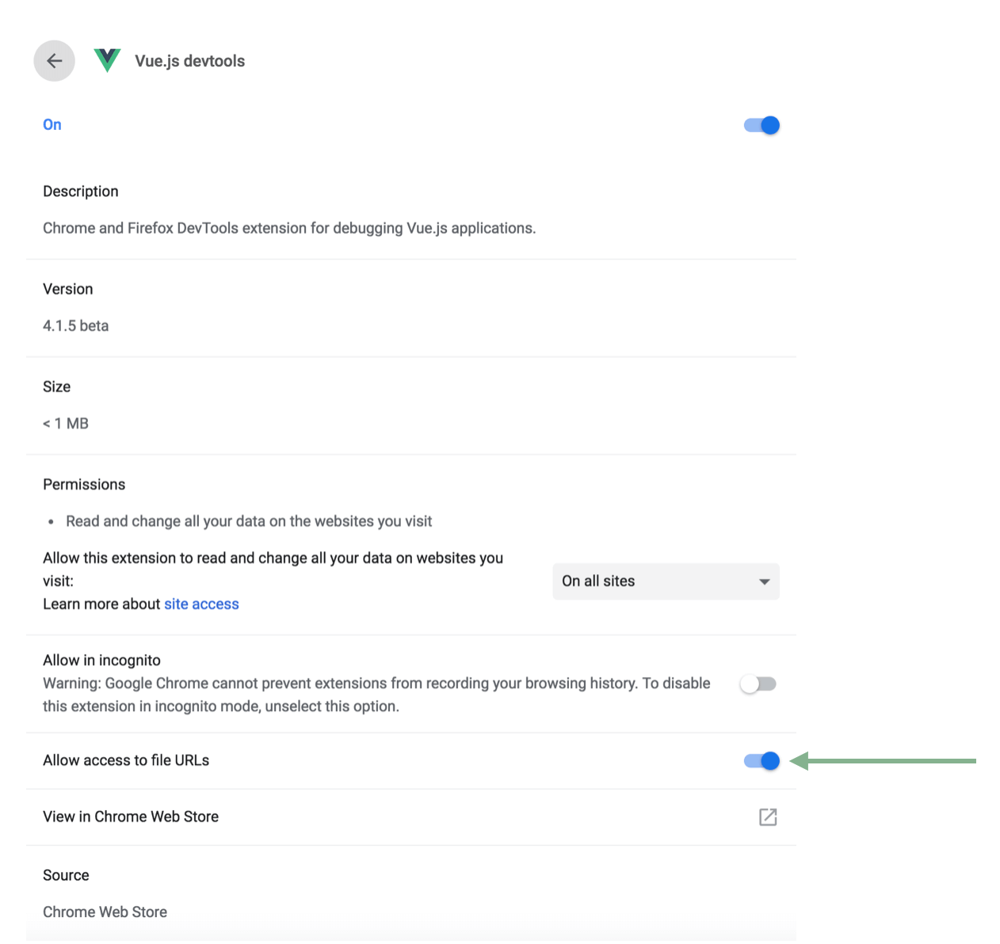
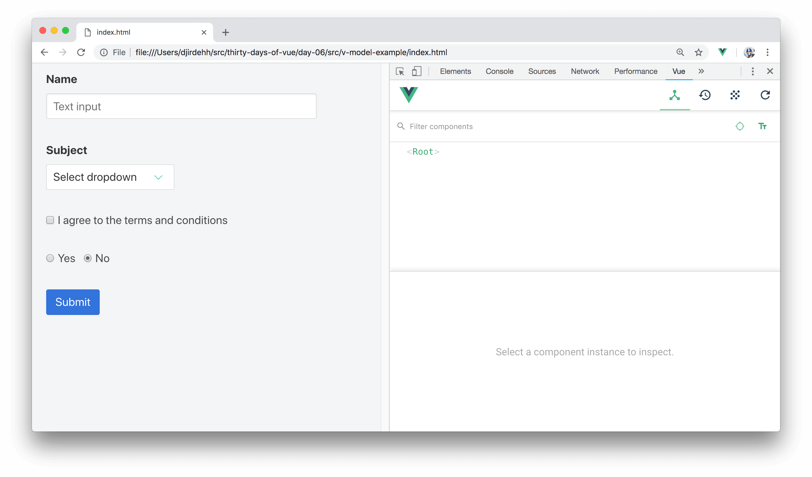
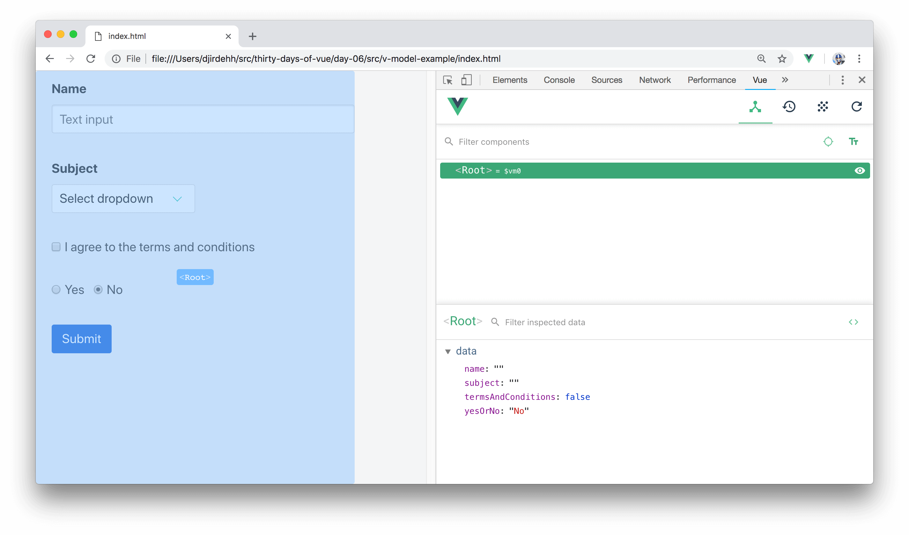
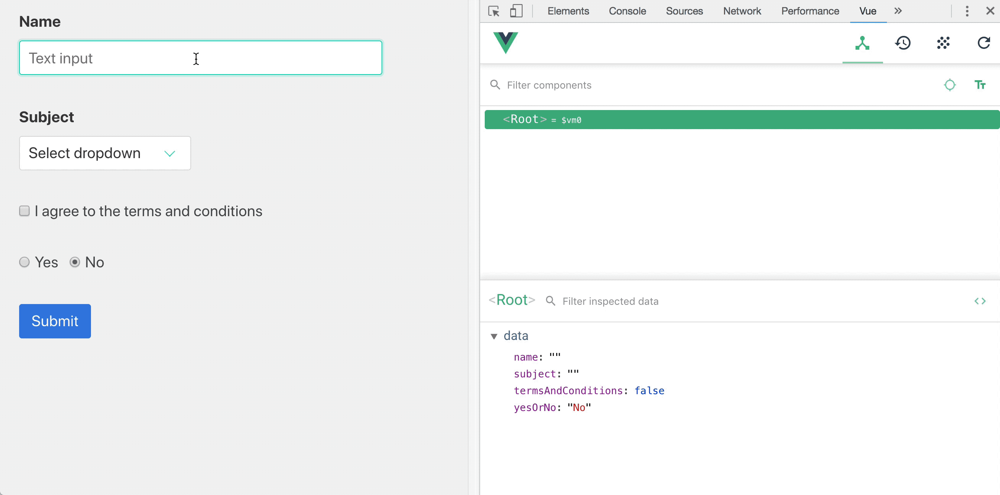

# Vue Devtools

> Today’s article is going to introduce the __Vue Devtools__ - a browser extension tool built to help debug Vue applications.

## Vue Devtools

The [Vue Devtools](https://github.com/vuejs/vue-devtools) is a development tool built and maintained by the Vue core team. It can be installed through one of the following formats:

- [Chrome Extension](https://chrome.google.com/webstore/detail/vuejs-devtools/nhdogjmejiglipccpnnnanhbledajbpd)
- [Firefox Addon](https://addons.mozilla.org/en-US/firefox/addon/vue-js-devtools/)
- [Standalone Electron App](https://github.com/vuejs/vue-devtools/blob/master/shells/electron/README.md)

If you don’t have the Devtools installed - feel free to install it with the format you prefer. We’ll be using and referencing the Devtools at separate points throughout the course.

When successfully installed on to a browser, we'll be able to see the icon available in our browser menu. If Vue is not detected in the page, the icon in the browser menu would be greyed out and the prompt will tell us that "Vue.js is not detected:

For applications that use Vue, the browser menu won’t be greyed out. However, we’ll be notified that we’re unable to use the extension if the app is in production or the Devtools is explicitly disabled:

Finally, for applications we develop locally and don’t have the Devtools explicitly disabled, we’ll be notified that Vue is detected and we’re able to use the extension:

## File based URLs - Chrome

If you’d like to use the Vue Devtools with applications opened via `file://` protocol in Chrome - you’ll need to enable  the “Allow access to file URLs” setting for the extension in Chrome’s extension manager:

In Firefox, the extension should have access to file based URLs by default.

## Using the Vue Devtools

Let’s use the Vue Devtools on the application we’ve set up in the last article. If we recall, we used the __v-model__ directive to help bind data properties to different inputs in a form:

<iframe src='./src/v-model-example/index.html'
        height="375"
        scrolling="no"
         >
</iframe>

Launching the application, opening the browser Devtools, and locating the Vue tab - we’ll be able use the Vue Devtools to debug our application:

> To use the Vue Devtools, you may need to open the application in a separate tab/window instead of surveying the app within the iframe. All code samples can be found for each respective article/day at the [Github Repo](https://github.com/fullstackio/30-days-of-vue/) (at [https://github.com/fullstackio/30-days-of-vue](https://github.com/fullstackio/30-days-of-vue/)).

In the "Components" tab, we're able to survey all the components (i.e. instances and child-instances) in our application. Our application only contains a single `<Root>` component which refers to the Vue instance of the entire Vue app. By selecting the `<Root>` component, we’re then able to survey the data properties instantiated in our app:

To better recognize how the __v-model__ directive allows for _two-way_ data binding, we can:

- Change something directly in our form and verify that `data` of our `<Root>` instance, in the Vue Devtools, is automatically updated.
- Change the value of a `data` property directly on the Vue Devtools and verify that our template re-renders to show the updated value.

Here's a GIF displaying just that.

By being able to directly update our application and monitor data changes (and vice-versa), the Vue Devtools is an especially useful tool for debugging Vue apps.

The Vue Devtools also offers a lot more capabilities like being able to track Custom Events, inspect props (data) being passed from one component to its child, and conduct time travel debugging in a Vuex integrated app. We’ll be discussing these features when we investigate the relevant concepts in the course.

Congrats on getting through the first week! In the next coming sections, we’ll be taking a deeper dive into the Vue instance.
