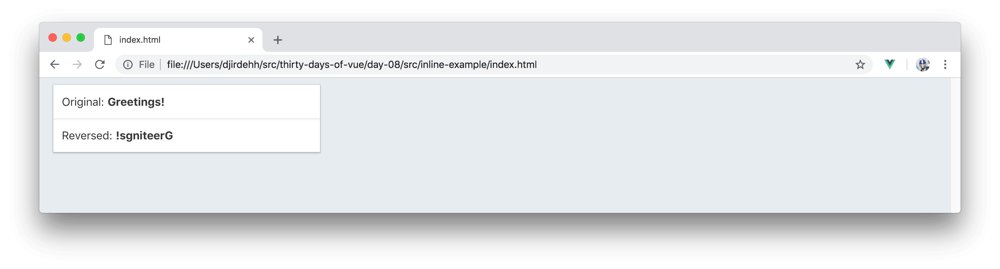
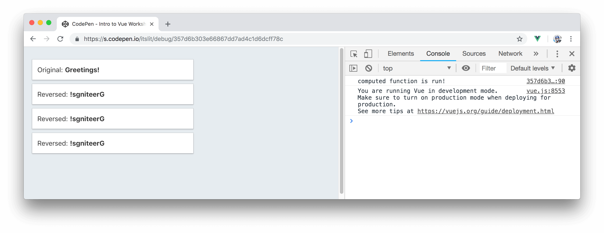
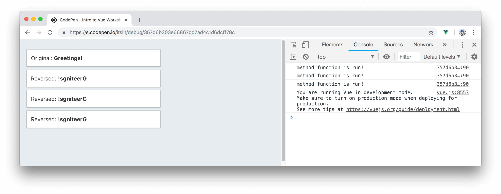
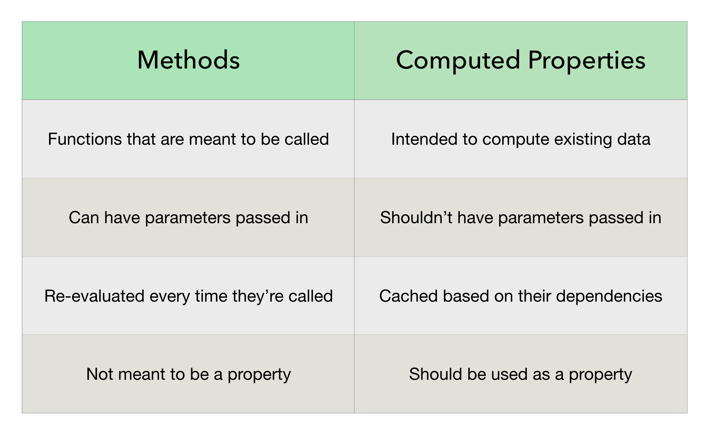

# Methods & Computed Properties

Phew! We made it to week two (relatively unscathed)! Through this point, we've talked through some of the basic features of the Vue instance (data reactivity), template binding (directives), and the Vue Devtools.

In this article, we're going to look at two specific properties of the Vue instance - __Methods__ and __Computed Properties__.

## Methods

We used methods in articles __#2__ and __#3__ to highlight reactivity of data contained within a Vue instance. To reiterate, methods in a Vue instance behave like normal JavaScript functions and are evaluated only when explicitly called. Instead of using methods we could always write our intended functionality change _inline_ in the template.

Let’s see an example of this. We’ll reuse an [example](https://vuejs.org/v2/guide/computed.html#Computed-Properties) seen in the Vue documentation that involves reversing a series of characters from a string. We'll first create a Vue instance that contains a single `greeting` property that has a value of `'Greetings!'`:

{lang=javascript,line-numbers=off}
<<[src/inline-example/main.js](./src/inline-example/main.js)

In the template, we’ll bind the `message` directly and also bind the `message` in its reversed state. We’ll reverse the value of `message` by splitting the property into an array of characters (`.split('')`), reversing the elements in the array (`.reverse()`), and rejoining the reversed array back into a single string (`.join('')`).

{lang=html,line-numbers=off}
<<[src/inline-example/index.html](./src/inline-example/index.html)

With the help of the styling given to us by [Bulma](https://bulma.io/documentation/), our simple app will look like the following:

__TODO - Show inline-example app instead of image__



There’s nothing inherently wrong with specifying functionality change, like the above, inline. However, __methods__ are often times more appropriate to use when the intended changes get harder to decipher.

We can change the above example to instead use a __method__ in our Vue instance to help reverse the `message` string:

{lang=javascript,line-numbers=off}
<<[src/methods-example/main.js](./src/methods-example/main.js)

The method is given a name of `reverseString` and expects a payload. We can declare this method in the template and pass in the `message` property as the payload:

{lang=html,line-numbers=off}
<<[src/methods-example/index.html](./src/methods-example/index.html)

Our UI would behave just the way it had before by displaying the message greeting and the reversed version right below it:

__TODO - Show methods-example app instead of image__


Functionality wise - the above two examples achieve the same thing. Methods might be seen to be more appropriate since it keeps the template cleaner and easier to understand.

We’re also able to achieve the same outcome as above with the use of another property - called the [__computed__](https://vuejs.org/v2/guide/computed.html#Computed-Properties) property.

## Computed Properties

__Computed__ properties are used to handle complex calculations of information that need to be displayed in the view. For our third iteration in building the same simple app, we'll introduce a __computed__ property called `reverseMessage` that simply reverses the `message` data property like we’ve done before:

{lang=javascript,line-numbers=off}
<<[src/computed-example/main.js](./src/computed-example/main.js)

In the template, we can render the value of the `reverseMessage` computed property just as we would have rendered any other data property:

{lang=html,line-numbers=off}
<<[src/computed-example/index.html](./src/computed-example/index.html)

With this, our app will behave as desired:

__TODO - Show computed-example app instead of image__


This begs the question, what difference is there to using a __computed__ property or have a __method__ instead return a value?

## Methods vs. Computed Properties

In the examples above, using a __method__ or a __computed__ property pretty much achieved the exact same outcome. The key difference to using __computed__ properties is that __computed properties are cached based on the dependencies they depend on__.

If we take a look at the `reverseMessage` computed property we’ve declared, we can see it has one data dependancy - the `message` property.

```javascript
computed: {
  reverseMessage() {
    return this.message.split('').reverse().join('');
  },
}
```

The value of `reverseMessage` directly depends on the `message` data property. When the value of `message` changes, so does `reverseMessage`. __Computed__ properties are useful because as long as the dependant data property (`message`) remains constant (i.e. unchanged), calling the __computed__ property (`reverseMessage`) multiple times will always return the _same cached value_.

Let's see a simple example of this visually. We can place a `console.log()` message in the __computed__ property function to alert us when the function has been run:

```javascript
computed: {
  reverseMessage() {
    console.log('computed function is run!');
    return this.message.split('').reverse().join('');
  },
}
```

In the template, we can aim to render the `reverseMessage` computed property a couple of times:

```html
<div id="app">
  <div class="card">
    <header class="card-header card-header-title">
      <span>Original:</span> {{ message }}
    </header>
  </div>
  
  <div class="card">
    <header class="card-header card-header-title">
      <span>Reversed:</span> {{ reverseMessage }}
    </header>
  </div>
  
  <div class="card">
    <header class="card-header card-header-title">
      <span>Reversed:</span> {{ reverseMessage }}
    </header>
  </div>
  
  <div class="card">
    <header class="card-header card-header-title">
      <span>Reversed:</span> {{ reverseMessage }}
    </header>
  </div>
</div>
```

By running the application and opening our browser console, we’ll see the `console.log()` message logged __only once__:



The first time the `reverseMessage` property is computed, its value is cached. With every other call to render the value of `reverseMessage`, the `message` property hasn’t changed, so the cached result is simply returned without running the __computed__ function again.

If we repeated a similar example but instead called __methods__ multiple times in the template, the `console.log()` message will be run every single time the method is declared:



In conclusion, though __methods__ can be used in place of __computed__ properties - __computed__ properties should essentially be used if we intend to _compute_ a value from a data property. Caching can help our application with performance once our application starts to have countless properties with each derived functionality potentially being somewhat computationally expensive.

Here's a table that highlights the main differences between using __methods__ or __computed__ properties:



A good rule of thumb to follow:

- Use __methods__ when responding to changes (e.g. clicking a button, submitting a form, etc.) or to run explicit functionality change within the instance (e.g. have a method be called from a lifecycle hook).
- Use __computed__ properties for data manipulation (e.g. create a sorted array from an unsorted array in the instance).

We’ll be stopping here for today! We’ll be taking a look at another instance property called __watchers__ tomorrow.
