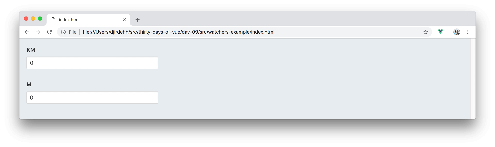

# Watchers

> Yesterday, we discussed how **methods** and **computed** properties work within a Vue instance. Today, we’ll briefly discuss another instance property called **watchers** (or sometimes known as the **watch** property).

## Watchers

The [**watch**](https://vuejs.org/v2/guide/computed.html#Watchers) property in Vue essentially allows us to **perform work in reaction to specific data changes**.

To see an example of **watchers**, we’ll create a simple app that contains two input fields - one to capture the distance in kilometers and the other in meters:



When the user types information in one particular field, we want the other input field to automatically display the equivalent value in its own unit. For example, when the user types the number `1` into the KM input field - the M input field should automatically display `1000` (`1KM` === `1000M`).

To get things started, we’ll instantiate a Vue instance that contains `km` and `m` data properties both initialized with values of `0`.

```javascript
new Vue({
  el: '#app',
  data: {
    km: 0,
    m: 0
  }
});
```

We’ll use the **v-model** directive to bind the `km` and `m` data properties to two separate input fields. Specifying placeholders and declaring input `type=number` to both fields will have our template look something like the following:

```html
<html>
  <head>
    <link rel="stylesheet" href="./styles.css" />
    <link rel="stylesheet"
      href="https://cdnjs.cloudflare.com/ajax/libs/bulma/0.5.3/css/bulma.css" >
  </head>

  <body>
    <div id="app">
      <div class="field">
        <label class="label">KM</label>
        <input v-model="km"
                class="input"
                type="number"
                placeholder="Type a length in KM!">
      </div>
      
      <div class="field">
        <label class="label">M</label>
        <input v-model="m"
                class="input"
                type="number"
                placeholder="Type a length in M!">
      </div>
    </div>
    <script src="https://unpkg.com/vue"></script>
    <script src="./main.js"></script>
  </body>
</html>
```

To achieve the desired outcome of having one input field be updated in response to the change in the other - we can use the **watch** property. To watch the change in the KM input field, we’ll declare the **watch** property to watch the `km` data value in our instance:

```javascript
new Vue({
  el: '#app',
  data: {
    km: 0,
    m: 0
  },
  watch: {
    km() {
      // whenever km changes, this function runs
    },
  }
});
```

Since we also want the KM input field to be updated in response to changes in the M input field, we’ll also declare a **watcher** on the `m` data value:

```javascript
new Vue({
  el: '#app',
  data: {
    km: 0,
    m: 0
  },
  watch: {
    km() {
      // whenever km changes, this function runs
    },
    m() {
      // whenever m changes - this function runs
    }
  }
});
```

The functions we’ve declared within the **watch** property are run _whenever_ the `km` or `m` data values have been changed respectively. This is how we’re essentially _watching_ these properties.

**Watch** properties automatically provide payloads of the new value upon change and the old value prior to the change:

```javascript
watch: {
  property(newVal, oldVal) {
    // ...
  }
}
```

For our application - we don’t need access to the old values, and the new values would be equal to the properties being watched. As a result, we won’t have the need to use any of these parameters.

As each **watch** function runs, we’ll update the other data property by either multiplying or dividing the watched property by 1000:

```javascript
new Vue({
  el: '#app',
  data: {
    km: 0,
    m: 0
  },
  watch: {
    km() {
      this.m = this.km ? this.km * 1000 : 0;
    },
    m() {
      this.km = this.m ? this.m / 1000 : 0;
    }
  }
});
```

We’re using the [ternary operator](https://developer.mozilla.org/en-US/docs/Web/JavaScript/Reference/Operators/Conditional_Operator) to update the value of the non-watched input to 0 if the watched property is ever invalid. Now, whenever a value is entered in an input; the other input field will be updated to show the change!

<iframe src='./src/watchers-example/index.html'
        height="215"
        scrolling="no"
         >
</iframe>

Awesome! Though this works perfectly well, a good question to ask right now would be - do we need **watchers** to do what we just did?

## Watchers vs. Computed properties

We could build the same application without the use of **watchers** and instead use **computed** properties. We know **computed** properties allow us to compute a new property from an existing data property. With no change to our template, we could drop the `m` value from the instance data object and instead compute it from the `km` value:

```javascript
new Vue({
  el: '#app',
  data: {
    km: 0
  },
  computed: {
    m() {
      return this.km * 1000;
    }
  }
});
```

When the value of `km` ever changes, the value of `m` will be updated. But this only works one way. How would we be able to update the `km` data property when the value of `m` gets changed? Though not the default way of using **computed** properties, [we can configure a **computed** property to be both a `getter` and a `setter`](https://vuejs.org/v2/guide/computed.html#Computed-Setter):

```javascript
new Vue({
  el: '#app',
  data: {
    km: 0
  },
  computed: {
    m() {
      get() {
        // get the value of m
      },
      set() {
        // when m changes - this function runs
      }
    }
  }
});
```

If we opt to declare a `get()` and `set()` function within a **computed** property, the `get()` function would be where we simply compute the value of the property. The `set()` function, however, would be the function that runs whenever the **computed** property gets directly changed.

In our case, we’d use the `get()` function to get the value of  `m` like we’ve done before. In the `set()` function, we’ll compute what the value of `km` would be whenever the `m` value ever changes. We’ll use the payload of the `set()` function which is the new value of the computed `m` property upon change to determine what the `km` value would be.

```javascript
new Vue({
  el: '#app',
  data: {
    km: 0
  },
  computed: {
    m: {
      get() {
        return this.km * 1000;
      },
      set(newValue) {
        this.km = newValue/1000;
      }
    }
  }
});
```

Our app would now work as expected! When one input changes, the other is updated.

<iframe src='./src/computed-example/index.html'
        height="215"
        scrolling="no"
         >
</iframe>

Can we always use **computed** properties in place of a **watcher**? No. In certain cases, you may find yourself in need of using the specific **watch** property.  The [Vue documentation](https://vuejs.org/v2/guide/computed.html#Watchers) states that _“[__watchers__ are] most useful when you want to perform asynchronous or expensive operations in response to changing data”_. In most cases, however, **watchers** tend to be overused where it might be [more appropriate to instead use a **computed** property](https://vuejs.org/v2/guide/computed.html#Computed-vs-Watched-Property).

Great work today! Tomorrow, we’ll be taking a look at the different lifecycle hooks a Vue instance contains before finally discussing Vue Components!
