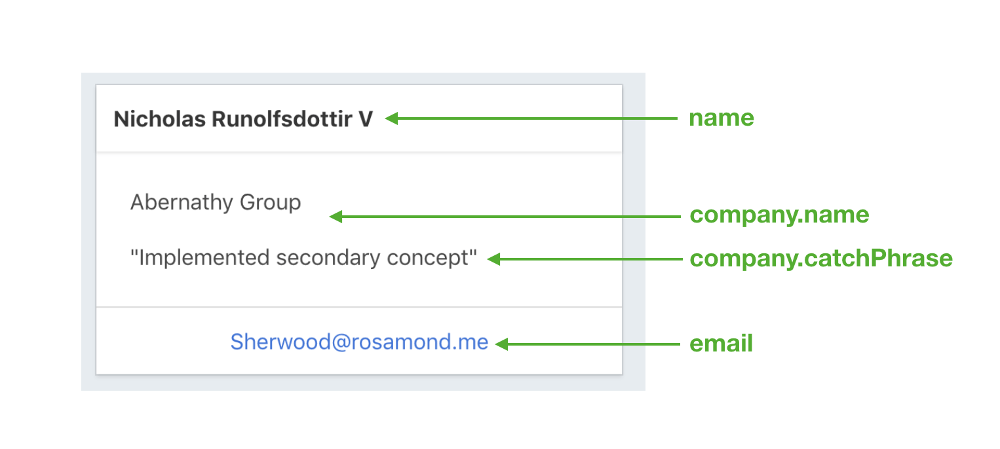
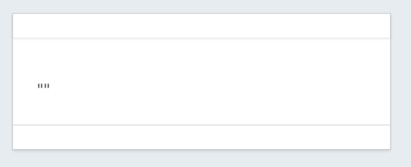
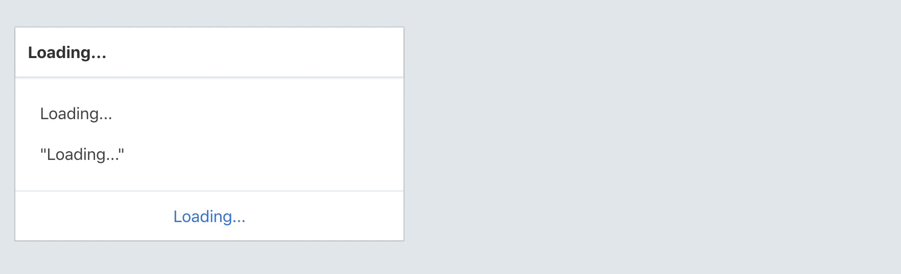
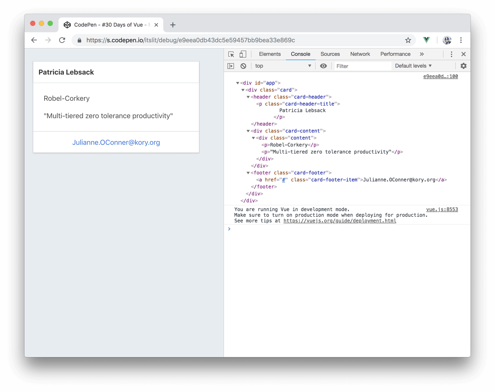
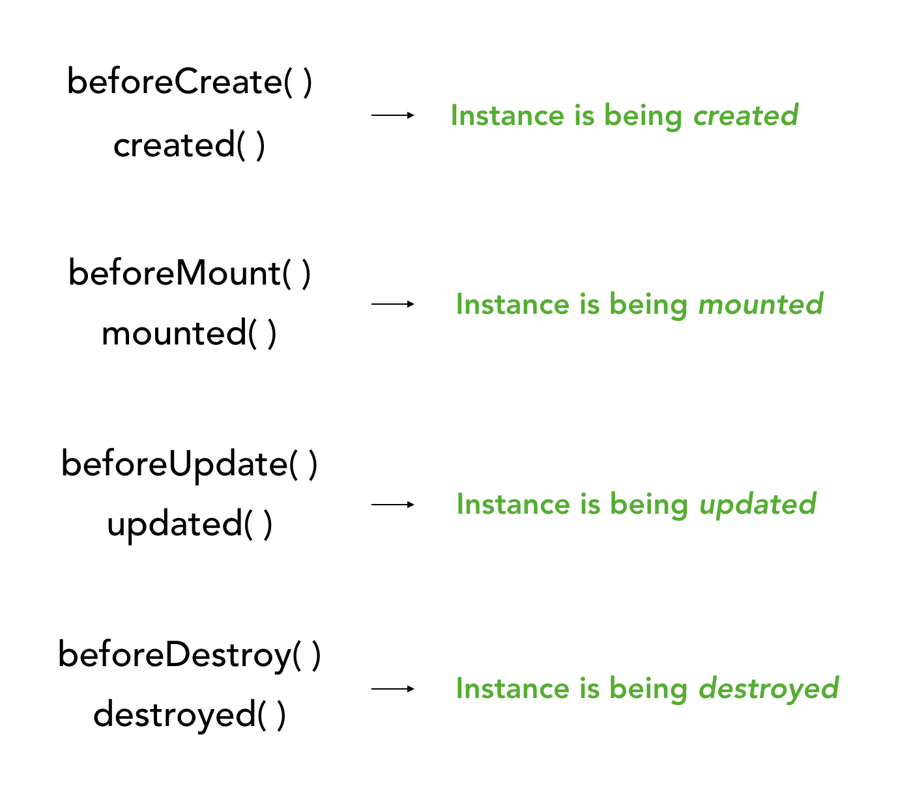

# Lifecycle Hooks

Today, we're going to talk a bit about how an instance _lives_ in an application. That is, we'll talk about the Vue instance’s _lifecycle_.

In a Vue instance, Vue gives us some hooks where we can insert our own functionality at different times in the instance’s lifecycle. In order to _hook into_ the lifecycle, we'll need to define functions on an instance which Vue calls at the appropriate time for each hook. An example of such a lifecycle hook is the __`created()`__ hook.

## created

The __`created()`__ hook is run when an instance has just been created, where the instance data and events are active, and when the instance can be accessed. Since the __`created()`__ hook is run the moment an instance has been created but _before_ the DOM has been mounted/rendered, it’s often the ideal moment to fetch data that is needed to populate the instance.

For today's article, let's attempt to display a card element in which its content is to be obtained from an external source. This card would look something like this:



The external data source that is to provide us with the data we need would be the [`/users`](https://jsonplaceholder.typicode.com/users) resource of [JSONPlaceholder](https://jsonplaceholder.typicode.com/) - a fake online REST API for testing and prototyping.

As we set our up our Vue instance, we’ll need to initialize all the data we intend to have displayed in the template:

```javascript
new Vue({
  el: '#app',
  data: {
    name: '',
    email: '',
    company: {
      name: '',
      catchPhrase: '',
    }
  },
});
```

We’ll utilize the [Card UI element from Bulma](https://bulma.io/documentation/components/card/) and bind the data on to our template:

{lang=html,line-numbers=off}
<<[src/created-example/index.html](./src/created-example/index.html)

We've introduced a `<script>` tag that references the [axios](https://github.com/axios/axios) library which will be the HTTP library we'll use to make our GET request.

At this moment, our card won’t display anything and look like the following:



Let’s update our Vue instance to make a request to the JSONPlaceholder API. We’ll declare the __`created()`__ hook and use the axios library to make our request.

```javascript
new Vue({
  el: '#app',
  data: {
    name: '',
    email: '',
    company: {
      name: '',
      catchPhrase: '',
    }
  },
  created() {
    axios.get('https://jsonplaceholder.typicode.com/users')
      .then((response) => {
        // Use response to update data
      });
  },
});
```

The [`/users`](https://jsonplaceholder.typicode.com/users) resource of the api returns details of 10 different users. For our application, we’ll randomly grab a single user object from the list and update the details of our instance data from that object. This would have our __`created()`__ hook look something like this:

```javascript
new Vue({
  el: '#app',
  data: {
    // ...
  },
  created() {
    axios.get('https://jsonplaceholder.typicode.com/users')
      .then((response) => {
        const data = response.data;
        const randomUser = response.data[Math.floor(Math.random() * data.length)];
 
        this.name = randomUser.name;
        this.email = randomUser.email;
        this.company.name = randomUser.company.name;
        this.company.catchPhrase = randomUser.company.catchPhrase;
      });
  },
});
```

When we launch our app, the __`created()`__ hook would run even before the DOM is mounted on the template. The axios call that gets fired in the hook happens _asynchronously_. With potentially poorer connections, the DOM might already be mounted while the _async call is still in-flight_. This could have the user see the card in its blank slate temporarily.


To make a quick change to alert the user that data might still be in the process of being fetched, we can initialize our instance data properties with `'Loading…'` values instead of a blank string:

```javascript
new Vue({
  el: '#app',
  data: {
    name: 'Loading...',
    email: 'Loading...',
    company: {
      name: 'Loading...',
      catchPhrase: 'Loading...',
    }
  },
  created() {
    // ...
  },
});
```

The user would now recognize that the app is “loading” if the data hasn’t yet been made available.



__TODO - Show created-example app here - keep gif above as well__

We should also always have an appropriate error case in our request to notify the user that something’s wrong when our call ever fails. We won’t be doing that here, but it might be a good exercise for you to try!

## mounted

The __`mounted()`__ hook is run after the instance has been _mounted_ and where the __rendered__ DOM can be accessed.

I> __What does mounting mean?__
I>
I> Vue tracks and makes changes to a _virtual representation_ of nodes in the DOM tree _before_ patching those changes on to the actual DOM. This in-memory view that Vue maintains and manages for us is often known as the __Virtual DOM__.
I>
I> Vue uses the virtual DOM to maintain/manage and track the changes in an application in a “less-expensive” way than directly tracking the changes being made on the actual DOM.
I> 
I> When we talk about __mounting__, we're talking about the process of converting the virtual elements into actual DOM elements that are placed in the DOM by Vue.

In the __`mounted()`__ hook of an instance, we’re able to access the rendered DOM with `this.$el`.

```javascript
new Vue({
  el: '#app',
  data: {
    // ...
  },
  created() {
    // ...
  },
  mounted() {
    console.log(this.$el);
  }
});
```

By console logging the rendered DOM in our card application, we’ll be able to read the information of the user that’s being rendered in our application.



Since we’re able to access the resolved DOM, the __`mounted()`__ hook is often best used when DOM dependant changes need to be made (i.e. when you need access to the DOM to make certain changes).

## updated

In article __#3__ of the course, we discussed how Vue applications are _reactive_ in nature. In short, when data is changed - the template is re-rendered (i.e. updated) to show the change. The __`updated()`__ hook gets fired whenever a data change is made that causes the instance to be updated/re-rendered.

I> The __`updated()`__ hook behaves like the __watch__ property but for the entire instance. It’s important to know that for specific state changes, the __watch__ property (or oftentimes __computed__ properties) should always be used instead.

In the __`updated()`__ hook, the accessible DOM refers to the resolved DOM _after_ the update has been made.

```javascript
new Vue({
  el: '#app',
  data: {
    // ...
  },
  created() {
    // instance has been created
  },
  mounted() {
    // instance has been mounted
  },
  updated() {
    // instance has been updated

    console.log(this.$el) // DOM after update is complete
  }
});
```

## destroyed

The __`destroyed()`__ hook is fired after an instance has been fully destroyed (which can be done with the [`vm.$destroy()`](https://vuejs.org/v2/api/#vm-destroy) method). This is the last hook that’s fired in the lifecycle and at this moment the instance event listeners, child instances and directives are all removed.

```javascript
new Vue({
  el: '#app',
  data: {
    // ...
  },
  created() {
    // instance has been created
  },
  mounted() {
    // instance has been mounted
  },
  updated() {
    // instance has been updated
  },
  destroyed() {
    // instance had been destroyed
  }
});
```

Though we may not find ourselves using the __`destroyed()`__ hook often, we’re able to use the hook to perform any last minute changes before our instance is ever completely removed.

## before hooks

For each of the standard lifecycle hooks (__`created()`__, __`mounted()`__, __`updated()`__, and __`destroyed()`__), Vue also provides hooks that run _just before_ these lifecycle events have occurred. These __before__ hooks are useful if we want to run some functionality before the intended lifecycle change has been made. Here’s a simple diagram that shows each of the methods and the stages of the lifecycle they represent:



The Vue Documentation has a very well laid out lifecycle diagram that addresses, in more detail, what happens as the instance goes through each stage of its lifecycle - [Instance Lifecycle Diagram](https://vuejs.org/v2/guide/instance.html#Lifecycle-Diagram).

These are __all the lifecycle hooks__ we can interact with in the Vue framework. We'll often find ourselves using these as we build our Vue apps, so it's a good idea to be familiar with them, that they exist, and how to hook into the life of an instance.

In the next section, we’ll be discussing a topic that we’ve deliberately avoided until now. We’ll be discussing __Vue Components__ and their role in building Vue applications!
