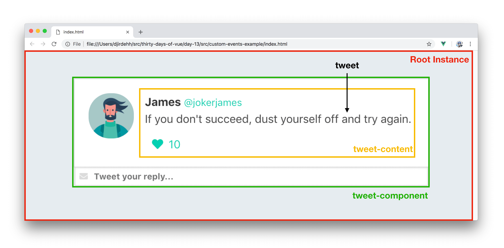
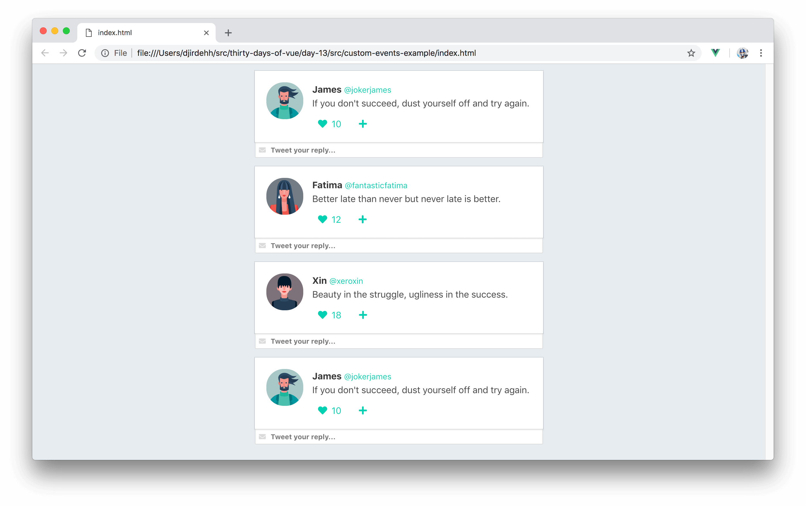
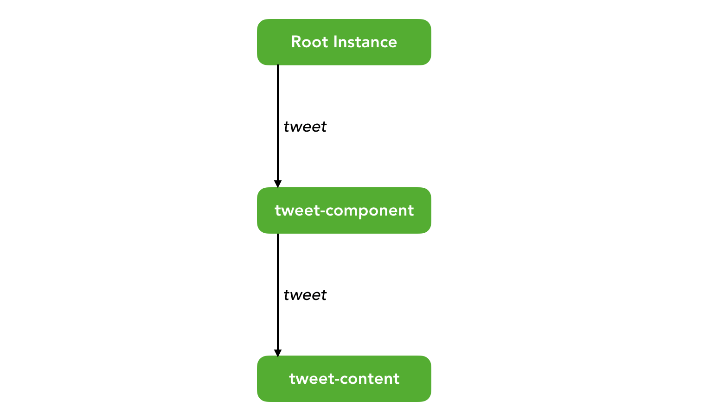
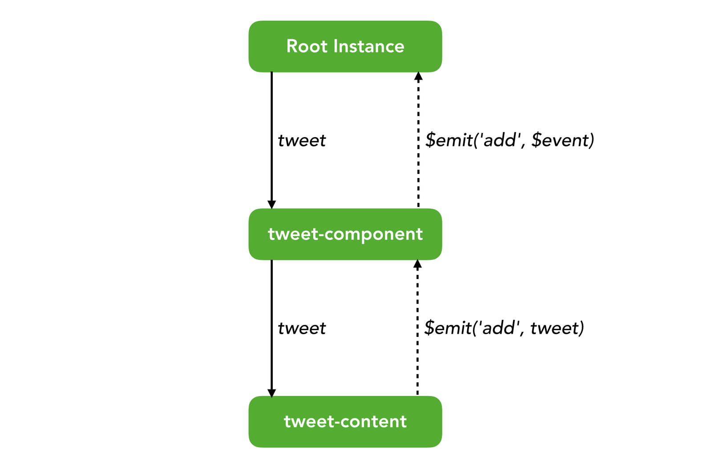

# Vue Components - Custom Events

In the last two articles - we introduced components, seen how they help make our Vue applications more modular and taken a look at how props help pass data from parent to child components.

What if we needed to find a way to communicate information in the opposite direction (i.e. have the child component notify the parent about something)? Let’s see a sample scenario of this with our mock twitter application.

At the last stage of building our mock twitter app, we had the root instance render a `tweet-component` which subsequently rendered a `tweet-content` component of its own. Props were used to pass the relevant `tweet` data object from the root instance downwards to `tweet-component` and further down to `tweet-content`.



Assume we wanted to introduce a link (or button) to the tweet element that upon click will re-introduce another copy of the _same_ tweet element into the bottom of the list of tweets. Though this might be a strange use case, it'll be a useful way to show how we intend to communicate information from the child _up to_ the parent.


The link that adds a new element upon click will be part of the `tweet-content` component while the data (`tweets` array) that controls the tweet elements in our list is part of the root instance.

To add a new tweet to the list of tweets, we'll essentially need to push a new `tweet` object into the `tweets` array. When the user clicks the link to add another tweet, we'll need to have some sort of event propagated up to the root instance to change the data kept in the instance. We can’t use props for this since props can only be used to pass data downwards (parent to child to grandchild). Since we want to create communication in the _opposite_ direction, we can use something known as Vue [__Custom Events__](https://vuejs.org/v2/guide/components-custom-events.html).

## Custom Events

Custom events in Vue behave very similar to [native JavaScript custom events](https://developer.mozilla.org/en-US/docs/Web/Guide/Events/Creating_and_triggering_events) but with one key distinction - __Vue custom events are used primarily for communication between components as opposed to communication between DOM nodes__.

Vue custom events are triggered using `$emit` while specifying the name of the custom event:

```javascript
this.$emit('name-of-event');
```

The `$emit` function can have a second optional argument that allows the caller to pass arbitrary
values along with the emitted event:

```javascript
this.$emit('name-of-event', {
  data: {
    course: '30 Days of Vue';
  }
});
```

I> The `this` keyword is a reference to the instance in which the event is being triggered. When declaring an event within the template of a component, the `this` keyword can be omitted.

In our mock twitter application, let’s update the template of `tweet-content` to contain the link that represents the ability to re-add the same tweet element to the bottom of the list. We’ll attach a click event listener on the link that when triggered will emit a custom event with the name of `add`. In the custom event declaration, we’ll also pass the `tweet` prop object as the event payload.

```javascript
Vue.component('tweet-content', {
  template: `
    <div class="media-content">
      <div class="content">
        // ...       
      </div>
      <div class="level-left">
        // ...
        <a class="level-item" @click="$emit('add', tweet)"">
          <span class="icon is-small">
            <i class="fas fa-plus"></i>
          </span>
        </a>
      </div>
    </div>
  `,
  props: ['tweet']
});
```

Upon click of the newly added link, the `add` event will get propagated one level up to `tweet-component`. For parent components to be able to listen to events emitted by children, the `v-on` directive can be used to create a _custom event listener_. That custom event listener needs to be declared __where the child component is being rendered__.

Since `tweet-component` doesn’t have access to the `tweets` data array that we want to update, we’ll need to propagate the event one level higher. To achieve this, we’ll create a custom event listener in `tweet-component` to listen for when the `add` event is triggered in `tweet-content`. When the event is triggered, we’ll trigger _another_ `add` event and pass in the event object (i.e. the `tweet` object payload). This updates the template of `tweet-component` to the following:

```javascript
Vue.component('tweet-component', {
  template: `
    <div class="tweet">
      <div class="box">
        <article class="media">
          // ...
          <tweet-content :tweet="tweet"
                          @add="$emit('add', $event)">
          </tweet-content>
        </article>
      </div>
    </div> 
  `,
  props: ['tweet']
});
```

In the event listener, we’re able to __access the event object that has been passed with `$event`__.

In the root template, we can now create the final listener. We’ll specify the event listener where `tweet-component` is being rendered and when triggered call a method labelled `addTweetMessage`. `addTweetMessage` will pass in the `$event` payload as the only argument to the method.

{lang=html,line-numbers=off,crop-start-line=12,crop-end-line=16}
<<[src/custom-events-example/index.html](./src/custom-events-example/index.html)

We’ll now create the `addTweetMessage` method in the root instance to introduce a copy of the event `tweet` object into our `tweets` array. To keep each tweet object unique, we’ll shallow copy the tweet event object and set the `id` of the copied object to be one greater than the last item in our `tweets` array. We’ll then push the newly copied item to the end of the data array with the help of the Array [`.push()`](https://developer.mozilla.org/en-US/docs/Web/JavaScript/Reference/Global_Objects/Array/push) method.

{lang=javascript,line-numbers=off,crop-start-line=82,crop-end-line=101}
<<[src/custom-events-example/main.js](./src/custom-events-example/main.js)

Awesome! We’ll now be able to add copied tweet elements to the end of the list by clicking the add icon on any tweet element.

__TODO - Show custom-events-example app here not img__



## Custom Events & Data

Let’s recap how data was manipulated in the app we just built. The root instance contains the `tweets` array and uses this array to render a list of `tweet-component`'s. For every `tweet-component` rendered, a unique `tweet` object prop is passed in which is then subsequently passed in to a `tweet-content` component. In each of the components, we bind the relevant information from the available `tweet` prop on to their respective templates.



When the user clicks the icon to add another tweet element, the `add` event is triggered in `tweet-content` and listened for in `tweet-component`. The event listener in `tweet-component` triggers another `add` event that’s being listened for in the root instance. With every event trigger, the `tweet` object payload is being passed through.



When the root instance event listener is triggered, the `tweet` object is shallow copied and added to the `tweets` array. In the root template, we use the `v-for` directive to render a list of tweet elements from the `tweets` array. As a result, when the `tweets` array is updated - our application is re-rendered to show the newly added element.

The way we've built our application _isn't_ the only way to achieve what we've just done. In fact, the process of using just __props__ and __custom events__ to handle data gets more complicated when we need to think about not only parent-child relationships but sibling-sibling components as well. What we’re starting to discuss here is the basis of application wide data management or in other words __state management__. We’ll be taking a deeper look into different state management processes soon (article __#19__ to be exact) but in the coming articles, we'll be spending more time discussing Vue components.

The main takeway from this article is that __props are always used to pass data downwards__ while __custom events are mainly used to send information upwards__.
