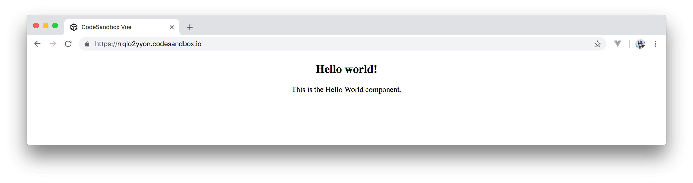
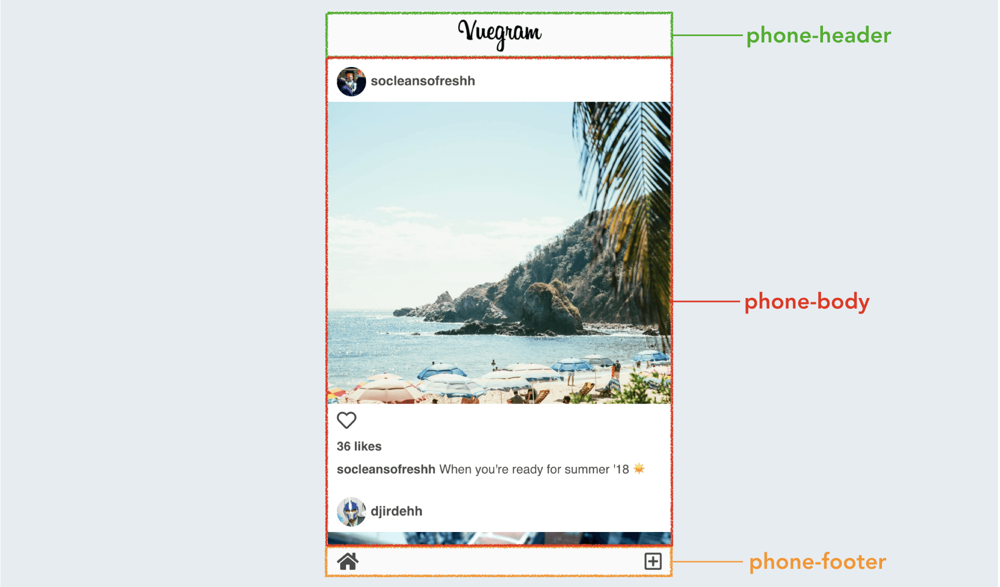
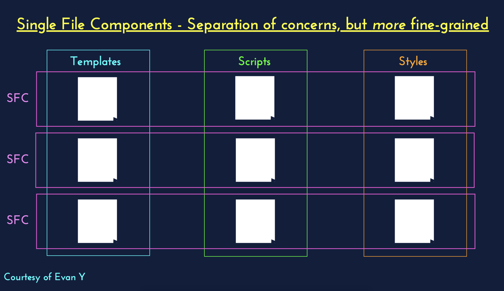

# Single File Components

> Today, we'll discuss one of Vue's most useful features in helping build large scale Vue applications - __Single File Components__.

We've made it through 16 days already! Pat yourself on the back... but not for too long... there is still a lot more.

From what we've seen in the past few articles, we now have a good picture of how the `Vue.component({})` constructor can be used to define global components and how we’re able to instead locally register components in the `components` property of a parent instance.

With either `Vue.component({})` or components assigned to constant variables, we had to write our component templates using ES6’s template literals to obtain a presentable multiline format.

```javascript
Vue.component('hello-world', {
  template: `
    <div>
     <h1>Hello World</h1>
     <p>This is the Hello World component</p>
    </div>
  `,
});
```

> We’ve also taken a quick look at alternate template definitions like `inline-template`'s and `x-template`'s but have come to understand that both of these approaches are not recommended to creating the markup of components.

Template strings do a good job for small to medium sized projects. However, as an application grows, having no syntax highlighting and the entire markup of a component kept within back-ticks (or strings) makes the template of components hard to read. In addition, the components we’ve defined thus far don’t allow us to isolate the unique CSS within them. This is where Vue’s [__Single File Components__](https://vuejs.org/v2/guide/single-file-components.html) can be used to help reduce this disorganization.

## Single File Components

__Single File Components__ allow us to define the HTML/CSS and JS of a component all within a single __.vue__ file.

A single-file component is composed of three parts:

- The __`<template>`__ section which contains the component’s markup in plain HTML.
- The __`<script>`__ section which contains all the JS logic within that component.
- The __`<style>`__ section which contains all the component styles.

Here’s an example of a single-file component given the name of `HelloWorld`:

```html
<template>
  <div class="hello-world">
    <h2>{{ getGreeting }}</h2>
    <p>This is the Hello World component.</p>
  </div>
</template>

<script>
export default {
  name: 'HelloWorld',
  data () {
    return {
      reversedGreeting: '!dlrow olleH'
    } 
  },
  computed: {
    getGreeting() {
      return this.reversedGreeting
        .split("")
        .reverse()
        .join("");
    }
  }
}
</script>

<style scoped>
.hello-world {
  width: 100%;
  text-align: center;
}
</style>
```

- The `<template>` of the `HelloWorld` component displays the value of the `getGreeting` computed property declared in the `<script>` section as well some static text.
- The `getGreeting` computed property simply reverses the `reversedGreeting` data property to return “Hello World!”. 
- The `<style>` section of the component has the `scoped` attribute which dictates the styles declared in the component will be applied to this and only this component.

If the application root template only rendered this component, our application would look like the following.



Though the structure of a single-file component may look different, everything we’ve discussed thus far with regards to instance/component properties __remains the same__. We’re able to use all the properties a Vue instance component contains like __data__, __methods__, __computed__ properties, __lifecycle hooks__, etc.

The main advantage to using single-file components is how we’re able to neatly define the markup, logic, and styles of a component all within a _single file_. By building our application in a module-based setting (e.g. with Webpack), we’re also able to take advantage of [modules](https://webpack.js.org/concepts/modules/#what-is-a-webpack-module) to break our application (and components!) to smaller discrete pieces.

As an interesting example, [here's a link to the application code needed to build Vuegram](https://codesandbox.io/s/8ypo1v7xq2) - a hobby app I built a while back to mimic the mobile Instagram app. ([Tutorial to building Vuegram](https://medium.com/fullstackio/tutorial-build-an-instagram-clone-with-vue-js-and-cssgram-24a9f3de0408))



Vuegram was built entirely with the help of Single File Components. If we were to achieve the same outcome with global `Vue.component({})` constructors in a simple standalone Vue application, things would get hard to read _really quickly_. This would be partly due to having no template syntax highlighting as well as the inability to use modules to import/export components.

## Single File Components and Seperation of Concerns

Traditionally, we may have found ourselves building the UI of an application in three distinct files - with the CSS, HTML, and JS all declared separately.

```shell
login/
  login-page.css // CSS Styling
  login-page.html // Markup page that imports CSS and JS
  login-page.js // JS functionality
```

Components, in modern web applications, have given us the ability to break our application down to smaller pieces and modules. Single File Components, in Vue, enhances this modular understanding by allowing us to couple the CSS, HTML, and JS of a component __all within a single file__.

```shell
login/
  LoginPage.vue // CSS, HTML, and JS all declared here
```

With Single File Components, we still separate the concerns of a section UI (i.e. component) but achieve this in a slightly different way. Here’s a reconstruction of an especially useful diagram, [created and presented by Evan You](https://www.youtube.com/watch?v=wZN_FtZRYC8&feature=youtu.be&t=352), that I've found helpful in visualizing this.



Evan You explains how useful single-file components are incredibly well in a few talks he's given before. [Here's a talk Evan's done at Laracon EU 2017 where he discusses single-file components](https://www.youtube.com/watch?v=wZN_FtZRYC8&feature=youtu.be&t=352).

## Single File Components and Webpack

An important note to keep in mind is that single-file components are __only made possible__ due to build tools like Webpack. These tools work alongside built Vue packages (like the [`vue-loader`](https://github.com/vuejs/vue-loader) library) to compile __.vue__ components to plain JavaScript modules.

A production-oriented Webpack bundled Vue application often contains the set-up of multiple build tools like [Webpack](https://webpack.js.org) configuration, [Babel](https://babeljs.io/) for transpiling ES6 code, [ESLint](https://eslint.org/) for code linting, single-file components compilation, etc. The daunting process of understanding and setting up all these build tools from scratch for newcomers (and non-newcomers alike) is sometimes given the term [JavaScript Fatigue](https://medium.com/@ericclemmons/javascript-fatigue-48d4011b6fc4).

Thankfully, Vue provides us with the __vue-cli__ (i.e the Vue command line interface) to help facilitate the _rapid_ building and developing of Webpack bundled Vue applications. With that being said, we’ll be stopping here today and be taking a look at the __vue-cli__ tomorrow!
