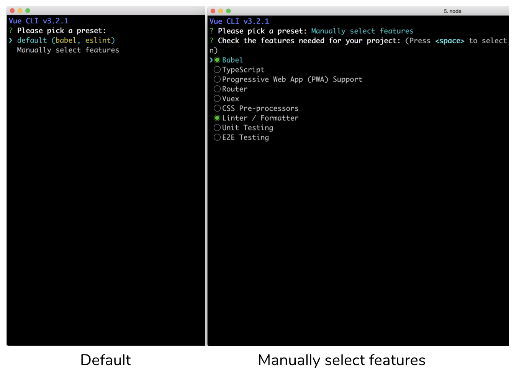
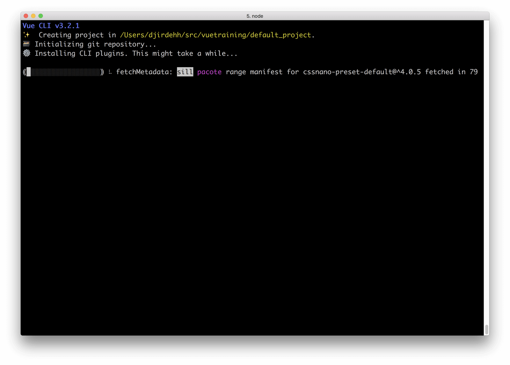
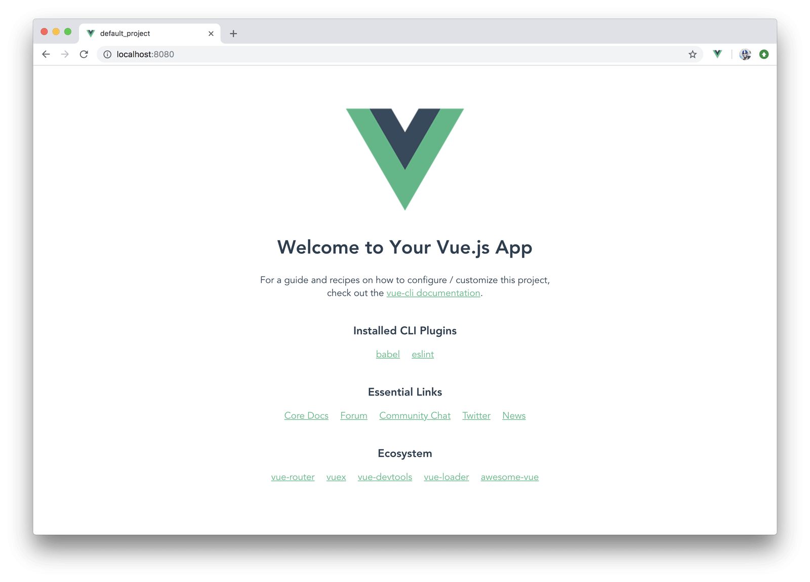
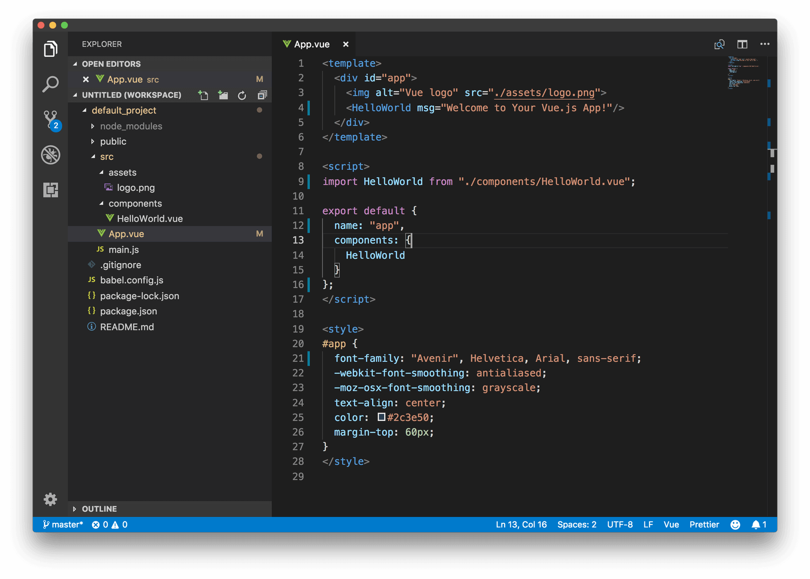
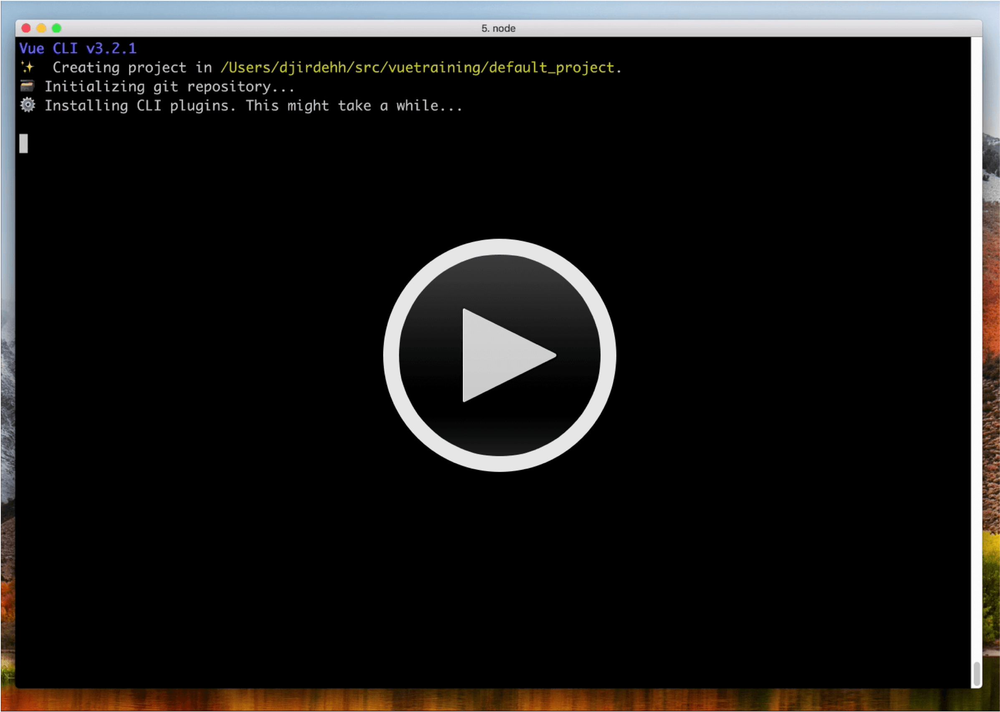
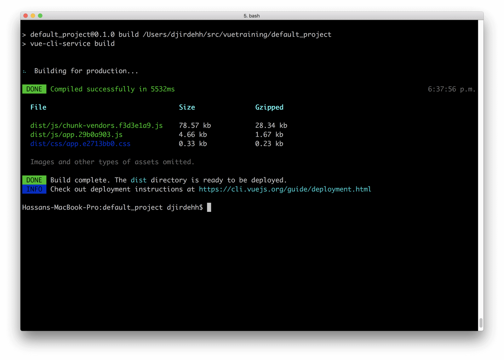
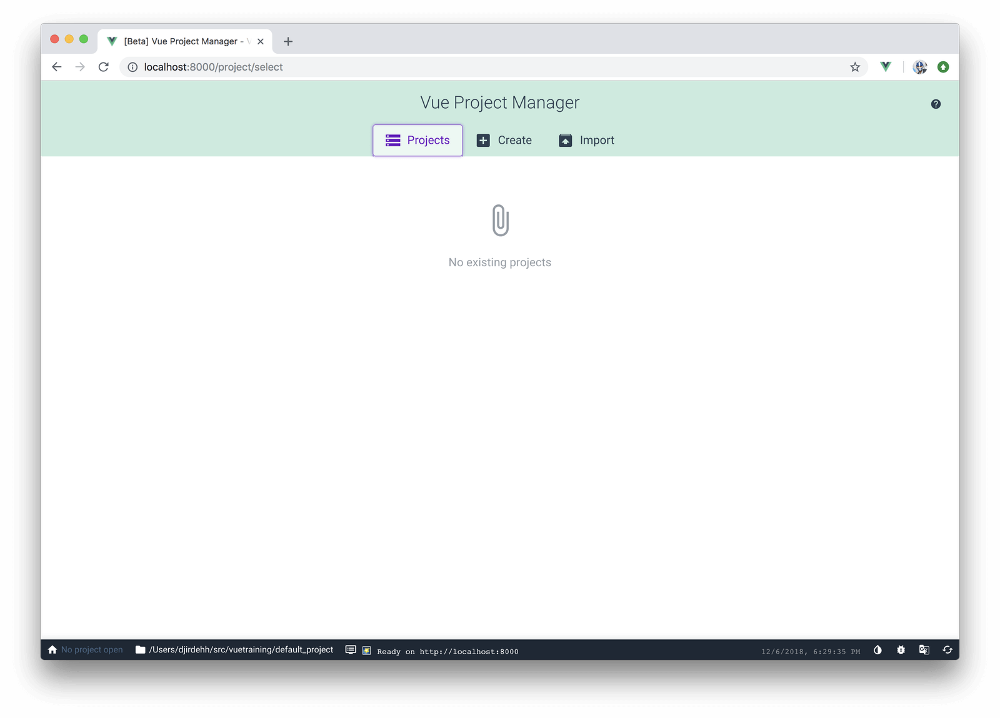
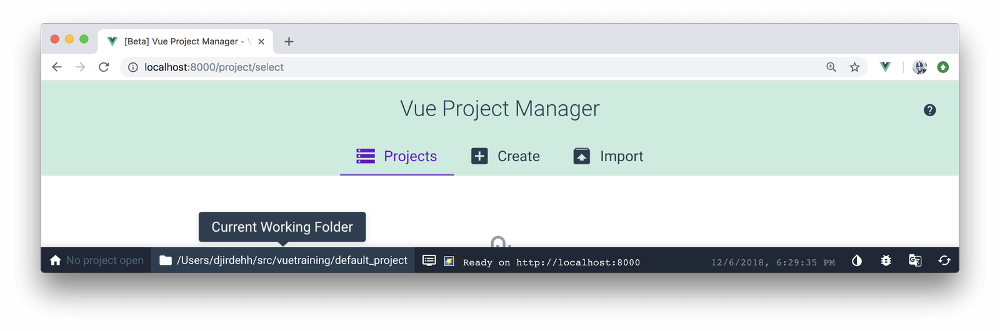
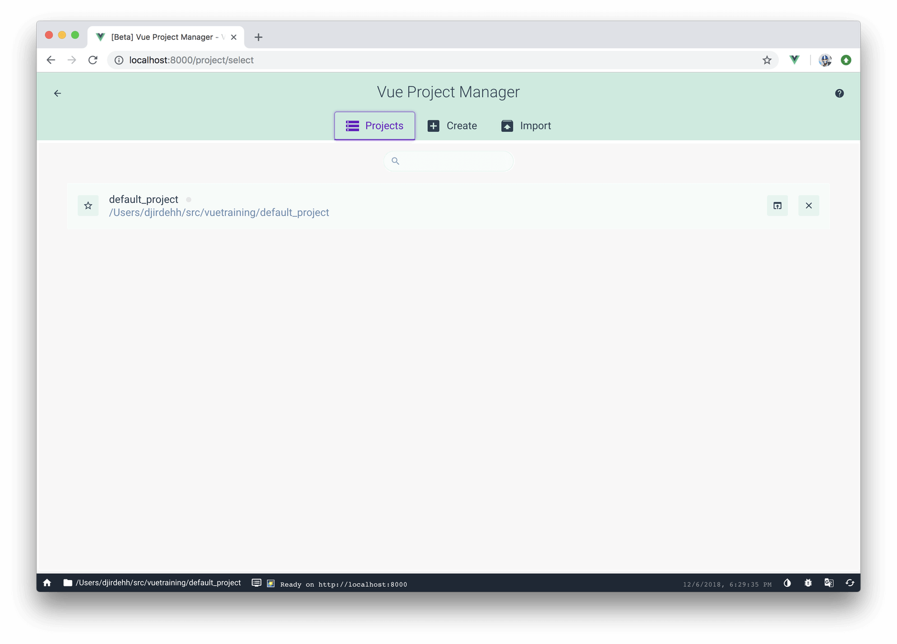
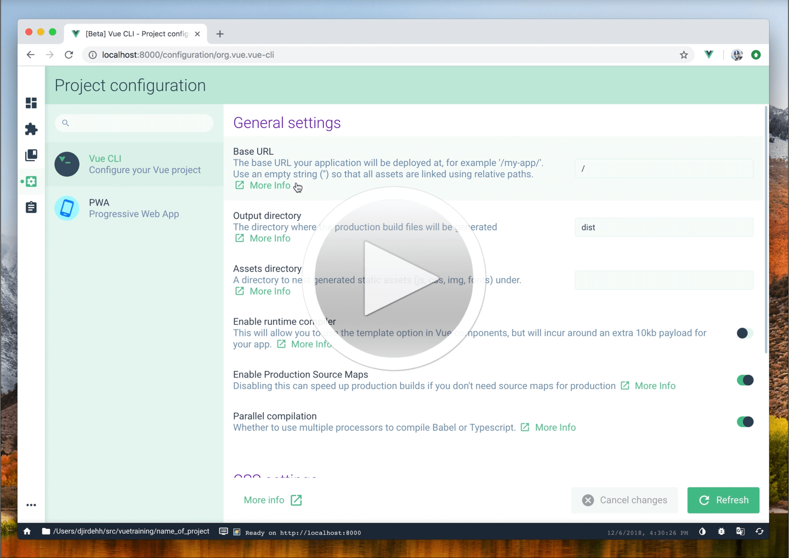

# Vue CLI

> Today, we're going to discuss Vue's official development tool in helping build and scaffold Webpack bundled Vue applications rapidly.

Yesterday - we talked about single-file components, the advantages they provide, and how we’re only able to use them with build tools like Webpack. Today, we’ll talk about how we can rapidly scaffold a brand new Webpack bundled Vue application with the [**Vue CLI**](https://cli.vuejs.org/guide/) (i.e. the Vue Command Line interface).

## The Vue CLI

The `vue-cli` is a tool built by the Vue core team to help facilitate the _rapid_ building and developing of Vue applications. The Vue command line interface allows us to get started right away without having us worry about all the steps needed to set up the different build tools in a module based Vue app.

Before use, the `@vue/cli` package needs to be installed globally:

```shell
npm install -g @vue/cli
```

I> You'll need a working [Node.js](https://nodejs.org/en/) development environment along with an appropriate Package manager (e.g. [npm](https://www.npmjs.com/) as the example shown above or [yarn](https://yarnpkg.com/en/)).

Once the `vue-cli` is installed globally, a new Vue project can be created by running `vue create` within a certain directory and specifying the name of the project we'd want to create. For this article, we’ll create a project with the name of `default_project`.

```shell
vue create default_project
```

When the vue create command is run; we’re provided with a prompt allowing us to select a default preset or manually pick series of features that we might find useful when building our Vue app (like TypeScript, PWA support, etc.).



We’ll select the default preset for this article. Once the selection is made, the Vue CLI will then begin to install all the necessary dependencies and create the project.



When complete, we’re provided with a new project directory that has a scaffold similar to this:

```shell
default_project/
  README.md
  babel.config.js
  node_modules/
  package.json
  public/
  src/
```

Here’s a a quick walkthrough of some of the main files and folders that are scaffolded in a default Vue CLI project:

**README.md**
All extra information/run steps are listed in the `README.md` file.

**babel.config.js**
The `babel.config.js` file contains configuration of Babel presets and plugins to help transpile ES6 JavaScript to ES5.

**node_modules/**
The `node_modules/` directory refers to all the different JavaScript libraries that have been installed into our project.

**package.json**
The `package.json` file lists all the locally installed npm packages in our application for us to manage in addition to having some built-in scripts already created for us (e.g. `serve`, `build`, `lint`). 

**public/**
The `public/` folder contains the root markup page (`index.html`) where our Vue application is to be mounted upon. `index.html` is where we can also add additional webfonts, style tags, etc. that we might need in our app.

**src/**
The `src/` directory contains the Vue/JavaScript code that we’ll find ourselves working directly with.

In addition to these files/folders, we would also see other files/directories for the extra build tools that we can set-up during a manual set-up (eg. `tsconfig.json` file for the TypeScript compiler options).

A `vue-cli` packaged app comes with a few built-in scripts it creates for us (which can be seen in the `package.json` file). Once the setup of our newly created project is complete, we can navigate into the project (cd `default_project`) and start our app using the `npm run serve` command.

```shell
npm run serve
```


With the Webpack server running, we’re then able to view our app at <http://localhost:8080/!>



If we open up the project `src/` folder in the code editor of our choice, we’ll see a simple Vue app constructed with single-file components. The `src/App.vue` file can be seen to be a basic Vue component that displays the Vue logo image and renders the `HelloWorld` component created in the `src/components/HelloWorld.vue` file.



The Vue CLI scaffolded project is [hot-module reloaded](https://webpack.js.org/concepts/hot-module-replacement/) which allows the application UI to automatically update when there’s a change (and save) in Vue code _without the need to make a hard refresh_.

How awesome is that! And when it comes to configuration, we’re able to continue configuring the build tools of our app as much as we want with no issues. **There is no concept of ejecting**.

Here’s a quick video of what we’ve just discussed above (the instantiation and running of a brand new Vue application with the default Vue CLI scaffold settings).

[](https://vimeo.com/306929031)

Though we won’t dive into discussing deployment and deployment patterns, a Vue CLI scaffolded project does have a `build` command for us to create minified, optimized versions of our app that we can upload to a server.

We can build our app using the `npm run build` command from the root of our project:

```shell
npm run build
```



## Vue CLI UI

As of Vue CLI 3.x, the Vue core team have built a full-blown graphical user interface for us to be able to create a `vue-cli` scaffolded project, install external plugins, and survey the details of said project _all within a graphical UI_.

Anywhere in our terminal, we’re able to launch the Vue CLI UI with the following command:

```shell
vue ui
```

This launches the Vue CLI UI where we’re presented with a series of different tabs.



We're able to see the list of projects imported to the UI in the `Projects` tab and create a brand new Vue CLI project with the `Create` tab. In our case, we’re interested in importing the project we’ve already created - `default_project`.

At the bottom of the screen, we’re presented with the status bar indicating which working directory the UI is currently referring to.



By being in the `default_project/` directory that we’ve created, we’re able to import this directory by clicking the `Import this folder` button present at the bottom of the screen in the `Import` tab. When imported, the directory will be part of the list of projects in the UI.



By opening up an imported project in the UI project manager, we’ll be able to perform a variety of different tasks such as viewing project dashboard details, adding external plugins, installing dependencies, etc.

Here’s a quick video highlighting the different information/changes we can assess from a project imported in the Vue CLI UI.

[](https://vimeo.com/306933876)

The Vue CLI is an incredibly useful tool in helping us set up a live-reloading, module based, single-page Vue app ready for development. Through the rest of the series, we’ll be working with single-file components within Vue CLI scaffolded projects. Tomorrow, we'll begin a series of discussions on the different ways we can manage data within medium to large scale Vue applications. Good job so far and see you tomorrow!
