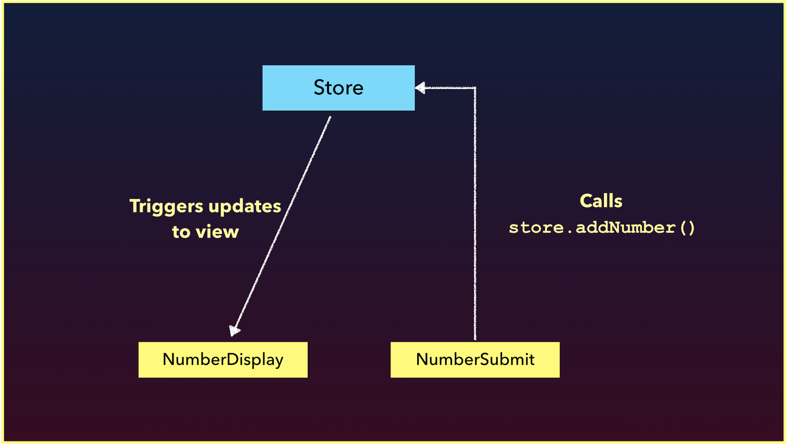

# Simple Global Store

> Yesterday, we gathered an understanding of how a global EventBus can use its events interface to have isolated components communicate with one another. Today, we’ll see how a __Simple Global Store__ can be a more useful approach to handling state management.

Though an EventBus is easy to set up - the significant disadvantage behind using one is the difficulty in being able to track data changes appropriately. In today's article, we’ll be looking at how a __Simple Global Store__ can be used to handle state management in a more robust manner.

## Simple Global Store

The term state management is used quite a bit. __State__ basically means data. State management often refers to the __management of application level data__.

Simple state management can be performed by creating a store pattern that involves sharing a data store between components. The store can manage the state of our application as well as the methods that are responsible in changing the state.

As an example, let’s adapt the code samples we’ve seen in the last article and look to create a store that will help us in this case. We can create a `store.js` file in the `src/` folder that exports a `store` object (which contains a `state` object within):

```javascript
export const store = {
  state: {
    numbers: [1, 2, 3]
  }
};
```
The `numbers` array in our store will be the array that needs to be either displayed or manipulated from more than one component. When it comes to changing this `numbers` array - we can look to keep our store centralized by adding all the methods (i.e. mutations) that can be done on the store state _in the store itself_.

To mimic the interaction we had in the last article, we’ll introduce an `addNumber` method to the store that accepts a payload and directly updates the `state.numbers` value with that payload.

{lang=javascript,line-numbers=off}
<<[src/simple-global-store-example/src/store.js](./src/simple-global-store-example/src/store.js)

We can now have a `NumberDisplay` component that’s responsible in displaying the `numbers` array from the store:

{lang=html,line-numbers=off}
<<[src/simple-global-store-example/src/components/NumberDisplay.vue](./src/simple-global-store-example/src/components/NumberDisplay.vue)

A `NumberSubmit` component will allow the user to add a new number to our store `numbers` data array:

{lang=html,line-numbers=off}
<<[src/simple-global-store-example/src/components/NumberSubmit.vue](./src/simple-global-store-example/src/components/NumberSubmit.vue)

The `NumberSubmit` component has an `addNumber()` method that calls the `store.addNumber()` mutation and passes the expected payload.

The store method receives the payload and directly mutates the `store.numbers` array. Thanks to Vue’s reactivity, whenever the `numbers` array in store state gets changed, the relevant DOM that depends on this value (`<template>` of `NumberDisplay`) _automatically updates_. This is because the `NumberDisplay` `storeState` data value is equivalent to the `store.state` object. When `store.state` changes, `NumberDisplay` `storeState` changes, and the template of `NumberDisplay` therefore re-renders.

<iframe src='https://thirty-days-of-vue-global-store.surge.sh/'
        height="215"
        scrolling="no"
        style='display: block; margin: 0 auto; width: 100%'>
</iframe>

When we say components interact with one another here, we’re using the term ‘interact’ loosely. `NumberDisplay` and `NumberSubmit` aren’t going to do anything directly to each other but instead invoke changes to one another _through_ the store.



Awesome! Everything works as intended and setting up a simple store wasn’t actually that difficult.

Though we won’t be adding anything else to our store, an important note to keep in mind is that we should always attempt to keep all application state and potential state mutations _within the store_. For example, let’s assume we wanted to introduce a few more potential store methods (like `removeLastNumber()` or `reverseNumbers()`) that we expect some components to call:

```javascript
store = {
  state: {
    numbers: [1, 2, 3]
  },
  addNumber(number) {
    this.state.numbers.push(number);
  },
  removeLastNumber() {
    this.state.numbers.pop();
  },
  reverseNumbers() {
    this.state.numbers.reverse();
  }
}
```

By centralizing everything within the store, it becomes easy to gather and understand all the data (and changes in data) that need be accessed and manipulated from an application wide standpoint.

## Simple Global Store and the Flux Pattern

If we take a closer look at all the pieces that _directly interact with the store_ between the `NumberDisplay` and `NumberSubmit` components, we can establish a pretty clear pattern.

- The method in the `NumberSubmit` component has the responsibility to directly _act_ on the store method, so we can label it as a __store action__.
- The store method has a certain responsibility which is to directly _mutate_ the store state. So we’ll say it’s a __store mutation__.
- `NumberDisplay` doesn’t really care about what type of methods exist in the store or in `NumberSubmit`, and is only concerned with _getting_ information from the store. So we can label `NumberDisplay` as a __store getter__ of sorts.

An __action__ commits to a __mutation__. The __mutation__ mutates __state__ which then affects the view (i.e. components). Components retrieve store data with __getters__. We’re starting to get _very close_ to the __Flux-like architecture__ of managing application wide state.

This would be a good place to stop for today. Tomorrow, we’ll pick up by looking at what the Flux architecture is before using Vue’s official Flux-like state management library - __Vuex__!
