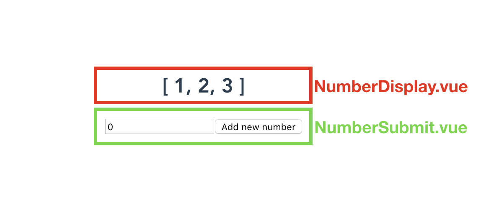

# Vuex

> With the knowledge of the Flux pattern and Vuex, let's integrate Vuex onto a Vue application to build on top of the things we've learned using a simple global store.

In the article before last, we saw how a simple global store allows us to manage application state in a reasonable manner that _mimics_ the Flux pattern. Today, we'll reimplement the same application using the most robust and widely-used, flux-like, state management library in Vue - [__Vuex__](https://github.com/vuejs/vuex).

We'll look to build the same `NumberDisplay` and `NumberSubmit` component relationship that we've done before. As a refresher, we’ll want to build an implementation where an input is entered in a `NumberSubmit` component and that entered number is then shown in the template of a sibling `NumberDisplay` component.



## Vuex

Since Vuex is an external library, it needs to be explicitly introduced into an application.

```shell
npm install vuex --save
```

For module based Webpack Vue applications, global level functionality (i.e. plugins) like Vuex need to be called with the `Vue.use()` global method prior to its use. The following code and the rest of the Vuex store instantiation can be done in a `src/store.js` file.

```javascript
import Vue from 'vue';
import Vuex from 'vuex';

Vue.use(Vuex);
```

The heart of a Vuex integration is the Vuex Store which can be created with the `new Vuex.Store({})` constructor. We can create the constructor and assign it a `const` variable we'll call `store`. We'll export the `store` variable since we'll need to include it in the application Vue instance shortly.

```javascript
import Vue from 'vue';
import Vuex from 'vuex';

Vue.use(Vuex);

export const store = new Vuex.Store({  
  // store properties
});
```

The Vuex Store is made complete with 4 objects - __state__, __mutations__, __actions__, and __getters__.

__State__ is simply an object that contains the data that needs to be shared within the application. We'll create a state object that only has a `numbers` array.

```javascript
const state = {
  numbers: [1, 2, 3]
};
```

__Mutations__ are functions responsible in directly _mutating_ store state. In Vuex, mutations always have access to the store `state` as the first argument. In addition, actions may or may not pass in a payload as the second argument. We'll create an `ADD_NUMBER` mutation that expects a payload and pushes that payload to the `state.numbers` array.

```javascript
const mutations = {
  ADD_NUMBER(state, payload) {
    state.numbers.push(payload);
  }
};
```

I> In Flux architectures, mutation functions are often characterized in capital letters to distinguish them from other functions and for tooling/linting purposes.

__Actions__ exist to call mutations. Actions are also responsible for performing any or all asynchronous calls prior to committing to mutations. Actions have access to a `context` object that provides access to store state (with `context.state`), to store getters (with `context.getters`), and to the commit function (with `context.commit`).

Here’s an `addNumber()` action that simply directly commits to the `ADD_NUMBER` mutation while passing in the expected payload:

```javascript
const actions = {
  addNumber(context, number) {
    context.commit("ADD_NUMBER", number);
  }
};
```

__Getters__ are to a Vuex store what computed properties are to a Vue component. Getters are primarily used to perform some calculation/manipulation to store state _before_ having that information accessible to components.

Like mutations, getters have access to state as the first argument. Here’s a getter called `getNumbers` that simply returns the `state.numbers` array:

```javascript
const getters = {
  getNumbers(state) {
    return state.numbers;
  }
};
```

I> For such a simple implementation like the application we're building, a Vuex store may not _really_ be necessary. We don’t necessarily need getters to directly return a state value and our action just simply commits to a mutation without any additional work. The examples above are meant to show the direct difference in implementation between using Vuex or a simple global store to handle application state.

With all the different store objects prepared, we can declare these objects within the `new Vuex.Store({}) constructor` to create our store instance. This makes our entire `src/store.js` file look like the following:

{lang=javascript,line-numbers=off}
<<[src/vuex-store-example/src/store.js](./src/vuex-store-example/src/store.js)

> Through the course, you may have noticed that we’re using ES6 property value shorthands to declare the values of properties in objects.
>
> For example, the store instantiation above can be expressed as:
>
> ```javascript
> const store = new Vuex.Store({  
>   state: state,
>   mutations: mutations,
>   actions: actions,
>   getters: getters
> });
> ```
>
> The ES6 property shorthand only works when the property value has the _same name_ as the property identifier.

When a Vuex store is prepared, it’s only made available to a Vue application by declaring the store object within the Vue instance. We'll import the `store` instance into the `src/main.js` file and pass it into the application wide Vue instance.

{lang=javascript,line-numbers=off}
<<[src/vuex-store-example/src/main.js](./src/vuex-store-example/src/main.js)

With a well built Vuex store, components often do one of two things. They either:

1. GET state information (by accessing store state or getters) or
2. DISPATCH actions

The `NumberDisplay` component will directly display the value of the `state.numbers` array from the store. It'll display the `state.numbers` value by mapping the `getNumbers` store getter on to the components `getNumbers` computed property.

{lang=html,line-numbers=off}
<<[src/vuex-store-example/src/components/NumberDisplay.vue](./src/vuex-store-example/src/components/NumberDisplay.vue)

The `NumberSubmit` component will hold the responsibility to allow the user to add numbers to the store `state.numbers` array. Adding numbers to the store `numbers` array can be done by mapping an `addNumber` component method to the store action of the same name.

{lang=html,line-numbers=off}
<<[src/vuex-store-example/src/components/NumberSubmit.vue](./src/vuex-store-example/src/components/NumberSubmit.vue)

Notice how we’re able to access the application wide store instance with `this.$store`.

Our application will now work as intended with the help of a Vuex store.

<iframe src='https://thirty-days-of-vue-vuex.surge.sh/'
        height="215"
        scrolling="no"
         >
</iframe>

> Live version - https://30dofv-vuex.surge.sh

We can see that Vuex extends the simple store method by introducing __explicitly defined actions, mutations, and getters__. This is where the initial boilerplate, as well as the main advantage comes in. In addition, another significant advantage to using Vuex is the integration with the Vue Devtools to provide __time-travel debugging__.

Here’s a quick gif that shows how the Vue Devtools helps us observe store information as mutations occur, as well as the ability to _time-travel_ the UI to the moment a particular mutation has occurred.

[](https://bit.ly/2VAhHIl)

> The app in the gif above is the [TodoMVC](https://vuejs.org/v2/examples/todomvc.html) example implementation built by the Vue core team.

Vuex isn’t the only Flux-like library that can be used with Vue. For example, community supported libraries like [redux-vue](https://github.com/nadimtuhin/redux-vue) or [vuejs-redux](https://github.com/titouancreach/vuejs-redux) exist to help bind Vue components with a Redux store. However, since Vuex was tailored to be used _only_ within the Vue ecosystem - it’s definitely the easiest to integrate with and use on a Vue application.

This now completes the series of articles catered to state management in Vue applications! In summary - Vuex is the most robust and supported method for managing application state but requires some flux-like understanding and comes with additional boilerplate. The simple global store method, on the other hand, is relatively easy to establish however state and possible state changes aren’t explicitly defined.

I> If you'd like to re-absorb the contents mentioned in this and the last couple of articles but in a different format - you can watch a talk I’ve given on this subject [here](https://youtu.be/B7g7MOrDtMY)!

Tomorrow we'll begin looking at another crucial piece to building large-scale Vue applications - __client-side routing__!

