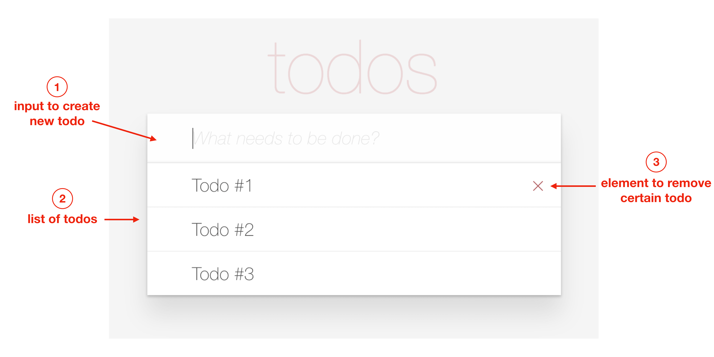
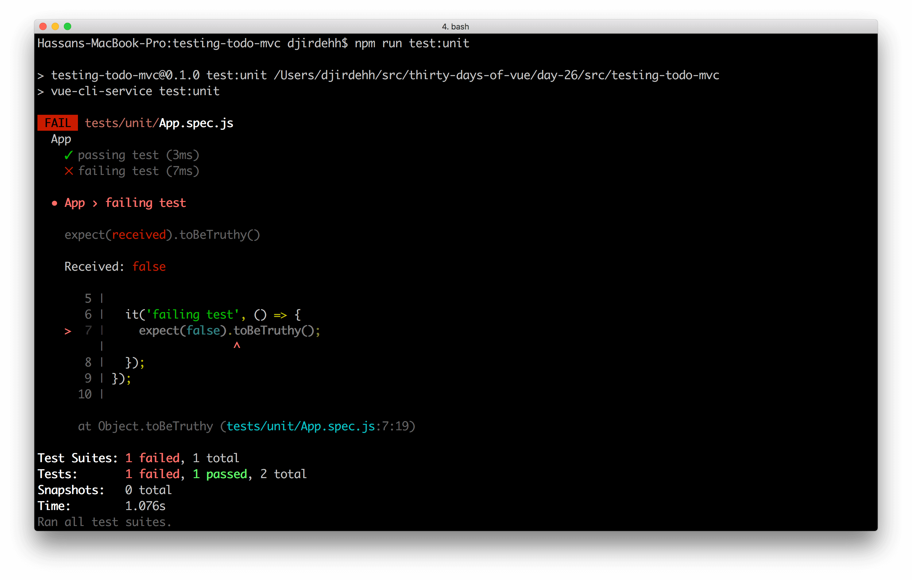
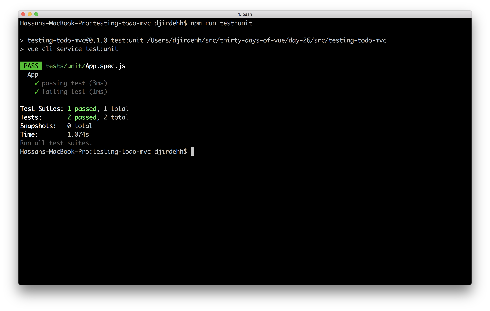

# Implementing Tests

Yesterday, we discussed the importance of testing and some of the different types of unit testing libraries/suites that exist. Today, we'll begin to see unit testing in action.

As mentioned in the last article, we'll be using the [Jest](https://jestjs.io/) testing framework. One of the main advantages behind using Jest is its zero configuration set-up. The [Getting Started](https://jestjs.io/docs/en/getting-started) guide in the Jest documentation shows us that we simply need to install the Jest package, create a `.test.js` or `.spec.js` file, and add a test script to the `package.json` file.

However, if we select the Jest suite as a dependancy we want in a Vue CLI scaffolded project - **this set-up would already be prepared for us**. We'll work within the test files of a project created with the Vue CLI that has the Jest testing suite installed.

## Simplified TodoMVC

The app we’ll be running our tests for is a simplified version of the [TodoMVC](http://todomvc.com/) open source project. We’ll only test a simple single-file Vue component which will help us understand how units tests can be made in Vue.

Our simplified TodoMVC app will have three distinct features; an input to enter new todo items, a list of entered todo items, and the ability to remove a todo item from the list.



The single `App.vue` component file that makes up our app will look like the following:

```html
<template>
  <div id="app">
    <section class="todoapp">
      <header class="header">
        <h1 class="title">todos</h1>
        <input
          class="new-todo"
          placeholder="What needs to be done?"
          v-model="newTodo"
          @keyup.enter="addTodo"
        />
      </header>
      <section class="main">
        <ul class="todo-list">
          <li class="todo" v-for="(todo, key) in todos" :key="key">
            <div class="view">
              <label>{{ todo }}</label>
              <button class="destroy" @click="removeTodo(todo);"></button>
            </div>
          </li>
        </ul>
      </section>
    </section>
  </div>
</template>

<script>
export default {
  name: "App",
  data() {
    return {
      todos: [],
      newTodo: ""
    };
  },
  methods: {
    addTodo() {
      if (this.newTodo !== "") {
        this.todos.push(this.newTodo);
        this.newTodo = "";
      }
    },
    removeTodo(todo) {
      this.todos.splice(this.todos.indexOf(todo), 1);
    }
  }
};
</script>

<style lang="css" src="./styles.css">
</style>
```

The `<template>` of the `App` component has the following details:

-   The `<header>` element has a title of ‘todos’.
-   The `<header>` has an input field that is bound to a `newTodo` data property. This input field listens for the  `keyup.enter` event (i.e. the release of the enter key) and when triggered calls an `addTodo` method.
-   Below the `<header>` exists a list of todo items displayed from a `todos` array stored in the components data. This list is rendered with the help of the `v-for` directive.

The `<script>` section of the component can be seen to have the following details:

-   `todos` and `newTodo` is initialized with a blank array and empty string respectively. `todos` is the list of todo items displayed in the list and `newTodo` is the data property tied to the controlled input.
-   In the `methods` property exists two methods - `addTodo()` and `newTodo()`. The `addTodo()` method first checks if the `newTodo` property isn’t blank and if not, it pushes the `newTodo` data value to the `todos` array before clearing `newTodo` back to an empty string.
-   The `removeTodo()` method uses the Array [splice()](https://developer.mozilla.org/en-US/docs/Web/JavaScript/Reference/Global_Objects/Array/splice) method to remove the intended todo item based on its index in the array.

The `<style>` tag has a `src` referenced from a `styles.css` file located within the `src/` folder.

With the `App` component appropriately declared in the root Vue instance (in the `src/main.js` file), our application will allow us to add and remove todo items from a list of todos.

**TODO - Show simple-todo-mvc app here not img**


## Writing tests

The Vue CLI introduces a `tests/` directory adjacent to the `src/` directory for a scaffolded project that has either the 'Unit Testing' or 'E2E Testing' option selected during manual set-up.

```shell
testing-todo-mvc/
  README.md
  babel.config.js
  node_modules/
  package.json
  public/
  src/
  tests/
```

The `tests/` directory will contain either the `unit/` or `e2e/` folders depending on which testing environment was selected during the Vue CLI set-up stage. In our case, only a `tests/unit/` folder will be created which would contain an `.eslintrc.js` file and an `example.spec.js` file.

```shell
testing-todo-mvc/
  ...
  tests/
    unit/
      .eslintrc.js
      example.spec.js
```

The `.eslintrc.js` file is often used to [configure ESLint rules within a particular directory or subdirectory](https://eslint.org/docs/user-guide/configuring). The `.eslintrc.js` file within our `tests/unit` folder simply declares the Jest framework as an environment our linter should recognize for any file within the `tests/unit` directory.

```javascript
module.exports = {
  env: {
    jest: true
  }
}
```

Specifying `jest: true` in the `env` option will configure the linter to recognize the set of predefined global variables that exists within the Jest framework.

The Vue CLI creates an `example.spec.js` file that has a sample test prepared for us. We'll remove this file and simply create an `App.spec.js` file which will be the file where we write our tests for the `App` component.

```shell
testing-todo-mvc/
  ...
  tests/
    unit/
      .eslintrc.js
      App.spec.js
```

Jest provides a few native methods that we'll be using. Both of the following methods accept two arguments, the first being a description string and the second a function to execute:

-   [`describe()`](https://jestjs.io/docs/en/api#describename-fn)
-   [`it()`](https://jestjs.io/docs/en/api#testname-fn-timeout)

> In Jest, the `it()` function is sometimes aliased to `test()`.

The `describe()` function provides a way for us to group our tests together in logical bundles. Since we're writing a bunch of tests for the `App` component, we'll use the `describe()` function in our test to indicate this.

```javascript
describe('App', () => {

});
```

We can add our first test using the `it()` function which is the function we can use to set our expectations. Let's set up our tests with our first expectations, one passing and one failing so we can see the difference in output.

In the same file, let's add two tests:

```javascript
describe('App', () => {
  it('passing test', () => {
    expect(true).toBeTruthy();
  });

  it('failing test', () => {
    expect(false).toBeTruthy();
  });
});
```

We'll look at the possible expectations we can set in a moment. First, let's run our tests.

## Executing tests

The Vue CLI package sets up a quality testing environment using Jest (if selected) automatically for us. We can execute all our tests by using the `test:unit` script declared in the `package.json` file.

```shell
npm run test:unit
```



From this output, we can see the two tests with one passing test (with a green checkmark) and one failing test (with the red x and a description of the failure).

Let's update the second test to make it pass by changing the expectation to `toBeFalsy()`:

```javascript
describe('App', () => {
  it('passing test', () => {
    expect(true).toBeTruthy();
  });

  it('failing test', () => {
    expect(false).toBeFalsy();
  });
});
```

Re-running the test, we can see we have two passing tests.

```shell
npm run test:unit
```



## Expectations

Jest provides a few global commands in our tests by default (i.e. things you don't need to require). One of those is the `expect()` command. The `expect()` command has a few expectations which we can call on it, including the two we've used already:

-   [`toBeTruthy()`](https://jestjs.io/docs/en/expect#tobetruthy)
-   [`toBeFalsy()`](https://jestjs.io/docs/en/expect#tobefalsy)
-   [`toBe()`](https://jestjs.io/docs/en/expect#tobevalue)
-   [`toEqual()`](https://jestjs.io/docs/en/expect#toequalvalue)
-   [`toBeDefined()`](https://jestjs.io/docs/en/expect#tobedefined)
-   [`toHaveBeenCalled()`](https://jestjs.io/docs/en/expect#tohavebeencalled)
-   etc...

The entire suite of expectations (i.e. `expect()` matchers) is available on the Jest documentation page at: <https://jestjs.io/docs/en/expect>.

The `expect()` function takes a single argument: the value or function that returns a value to be tested. For instance, our two tests we've already written pass the boolean values of `true` and `false`.

Now that we've confirmed our testing setup, we'll actually get down to testing our `App` component tomorrow. Great job today and see you tomorrow!
