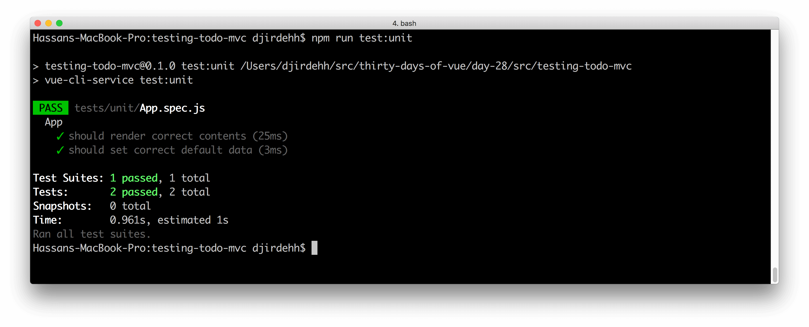
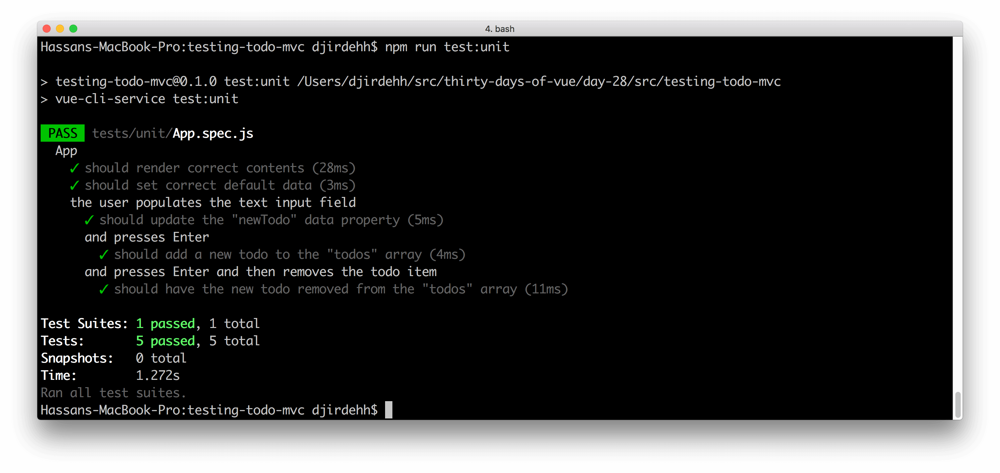

# Better testing with Vue Test Utils

> Today, we'll look at Vue’s official testing library called [__Vue Test Utils__](https://vue-test-utils.vuejs.org/) that makes testing fun and relatively easy.

Yesterday, we constructed our tests through simple assertions that involved either mounting the component constructor or invoking the component data function. Although this worked well, testing can become a bit cumbersome when more complicated functionality needs to be tested. __Vue Test Utils__  is a testing utility library created and maintained by the Vue core team that offers a nicer, higher-level API for dealing with Vue components under test.

In the last article, we were testing against an `App` component which rendered a simple todo list.


## Using Vue Test Utils

Yesterday, we wrote our first two tests as the following:

{lang=javascript,line-numbers=off}
<<[src/testing-todo-mvc/tests/unit/App.spec.js](../day-27/src/testing-todo-mvc/tests/unit/App.spec.js)

Let's see what these tests look like when we rewrite it with the Vue Test Utils library.

Since Vue Test Utils is an external library we want to introduce, we’ll first usually need to install it into our application.

```shell
npm install @vue/test-utils --save-dev
```

Vue Test Utils allows us to test the output of just a single component (e.g. `App`) rather than testing the entire complete component tree. This is often called _shallow_ rendering and basically means that if the parent `App` component had any children, _they wouldn’t be rendered_ in our tests.

Vue Test Utils makes shallow rendering super easy by allowing us to use the `shallowMount()` function to mount our component.

Let’s update the `src/App.spec.js` file to include the `shallowMount()` function from Vue Test Utils. We won’t have the need to import the Vue library itself anymore as well.

```javascript
import App from '@/App';
import { shallowMount } from '@vue/test-utils';

describe('App', () => {
  it('should render correct contents', () => {
    // our old tests
  });
  
  it('should set correct default data', () => {
    // our old tests
  });
});
```

I> __Shallow? Mount?__
I> 
I> The advantages behind shallow rendering is the enforcement of testing the component in isolation and it being a faster approach overall. Since `App` doesn’t render any children components of its own - normal mounting with the `mount()` function from Vue Test Utils will achieve a similar result here.

To render our component, we can use the `shallowMount()` method and store the result in a variable. Then, we'll query the rendered component for different HTML elements that are rendered inside its virtual DOM.

Our first test will be comprised of only a few lines:

```javascript
import App from '@/App';
import { shallowMount } from '@vue/test-utils';

describe('App', () => {
  it('should render correct contents', () => {
    let wrapper = shallowMount(App);
    expect(wrapper.find('.title').text())
      .toBe('todos');
    expect(wrapper.find('.new-todo').element.placeholder)
      .toBe('What needs to be done?');
  });
  
  it('should set correct default data', () => {
    // our old tests
  });
});
```

We’re using the test utility wrapper [`find()`](https://vue-test-utils.vuejs.org/api/wrapper/find.html) method to return a wrapper of the HTML elements we’re looking for. For the header title, we’re then simply able to use the wrapper [`text()`](https://vue-test-utils.vuejs.org/api/wrapper/#text) method to return the text content of the title element. For the input field, since a placeholder method doesn’t exist in Vue Test Utils, we retrieve the `element` from `wrapper.find('new-todo')` from which we can get the placeholder.

Our second test would be fairly simple as well. With Vue Test Utils, we’re able to access the properties of an instance with [`wrapper.vm`](https://vue-test-utils.vuejs.org/api/wrapper/#properties). With `wrapper.vm` available to us, we can directly access the component `todos` and `newTodo` data properties to create our assertions:

```javascript
import App from '@/App';
import { shallowMount } from '@vue/test-utils';

describe('App', () => {
  it('should render correct contents', () => {
    let wrapper = shallowMount(App);
    expect(wrapper.find('.title').text())
      .toBe('todos');
    expect(wrapper.find('.new-todo').element.placeholder)
      .toBe('What needs to be done?');
  });
  
  it('should set correct default data', () => {
    let wrapper = shallowMount(App);
    expect(wrapper.vm.todos).toEqual([]);
    expect(wrapper.vm.newTodo).toEqual('');
  });
});
```

We can run our tests in the same manner as we've done before by using the `test:unit` script available in our project.

```shell
npm run test:unit
```



Our tests pass and are now more maintainable moving forward!

Let's continue writing assertions. We’ll declare a few more assumptions that we expect our upcoming tests to address:

- When the user populates the text input field, it should update the `newTodo` data property.
- When the user populates the text input field and releases the Enter key, it should add the entered `todo` item to the `todos` array.
- When the user populates the text input field, releases the Enter key, then clicks the remove icon of the entered item, it removes this todo item from the `todos` array.

We'll structure the rest of our test suite first by writing out our `describe` and `it` blocks. We'll fill out the specs with assertions after. Since we’ll need the shallow mounted wrapper for every test, we can initialize the mounting process in the Jest [`beforeEach()`](https://jestjs.io/docs/en/setup-teardown#repeating-setup-for-many-tests) function which would run before every unit test. With all that said, our test suite will now be structured as the following:

```javascript
import App from '@/App';
import { shallowMount } from '@vue/test-utils';

describe('App', () => {
  let wrapper;

  beforeEach(() => {
    wrapper = shallowMount(App);
  });

  it('should render correct contents', () => {
    let wrapper = shallowMount(App);
    expect(wrapper.find('.title').text())
      .toBe('todos');
    expect(wrapper.find('.new-todo').element.placeholder)
      .toBe('What needs to be done?');
  });
  
  it('should set correct default data', () => {
    expect(wrapper.vm.todos).toEqual([]);
    expect(wrapper.vm.newTodo).toEqual('');
  });
  
  describe('user populates the text input field', () => {
    it('should update "newTodo"', () => {});

    describe('and presses Enter', () => {
      it('should add a new todo to "todos"', () => {});
    });

    describe('and presses Enter + removes todo', () => {
      it('should have the new todo removed', () => {});
    });
  });
});
```

I> If we were following Test Driven Development (or TDD for short), we would write these assumptions first and then build the component to pass these tests.

Let's fill in these tests so that they pass against our existing `App` component.

The interactions a user can have with our app has to start with first populating the input field to add a new item. We want to simulate this behavior in the next set of specs. To avoid the repetition of finding the input, updating the value, and triggering an event for each remaining test; we can extrapolate this set-up to a `beforeEach()` function in the nested `describe()` block:

```javascript
import App from '@/App';
import { shallowMount } from '@vue/test-utils';

describe('App', () => {
  let wrapper;

  // ...
  
  describe('user populates the text input field', () => {
    let inputField;


    beforeEach(() => {
      inputField = wrapper.find('.new-todo');
      inputField.element.value = 'New Todo';
      inputField.trigger('input');
    });

    it('should update "newTodo"', () => {});

    describe('and presses Enter', () => {
      it('should add a new todo to "todos', () => {});
    });

    describe('and presses Enter + removes todo', () => {
      it('should have the new todo removed', () => {});
    });
  });
});
```

In the newly created `beforeEach` function, we’re simulating the behavior of how a user creates an input event by:

1. First finding the `input` wrapper with `.find()`.
2. Then setting the value of the `input` DOM element to ‘New Todo’.
3. And finally using the wrapper [`trigger()`](https://vue-test-utils.vuejs.org/guides/#testing-key-mouse-and-other-dom-events) method to fire off the `input` event and simulate actual user interaction.

We’re now able to write specs related to the context where the user has just populated the input field. Our first upcoming test is fairly simple since we want to assert that when the user populates the text input field, it updates the `newTodo` data property in the component.

To verify if the `newTodo` data property has been updated, we’ll simply assert whether the `newTodo` property is equal to the input value we’ve set in the `beforeEach()` function:

```javascript
describe('user populates the text input field', () => {
  let inputField;

  beforeEach(() => {
    inputField = wrapper.find('.new-todo');
    inputField.element.value = 'New Todo';
    inputField.trigger('input');
  });

  it('should update "newTodo"', () => {
    expect(wrapper.vm.newTodo).toEqual('New Todo');
  });

  describe('and presses Enter', () => {
    it('should add a new todo to "todos"', () => {});
  });

  describe('and presses Enter + removes todo', () => {
    it('should have the new todo removed', () => {});
  });
});
```

The next test involves asserting whether the todo item is added to the list when the user releases the Enter key after the text input field is populated. For this assertion, we’ll first trigger the `keyup.enter` event before asserting the value of the `todos` array in the component data.

```javascript
describe('user populates the text input field', () => {
    // ...
    describe('and presses Enter', () => {
      it('should add a new todo to "todos"', () => {
        inputField.trigger('keyup.enter');
        expect(wrapper.vm.todos).toEqual(['New Todo']);
      });
    });
    // ...
  });
```

For the last assertion, we’ll first trigger the `keyup.enter` event before asserting whether the removal of a todo item works as intended. To mimic the removal of a todo item, we’ll `find()` the wrapper of the remove icon element based on its class (`.destroy`), trigger a click event on this found wrapper, and assert that the value of the `todos` array doesn’t contain the item that was just added in the `beforeEach()` function.

```javascript
describe('user populates the text input field', () => {
  // ...
  describe('and presses Enter + removes todo', () => {
    it('should have the new todo removed', () => {
        inputField.trigger("keyup.enter");
        const removeIcon = wrapper.find(".destroy");
        
        removeIcon.trigger("click");
        
        expect(wrapper.vm.todos).toEqual([]);
    });
  });
});
```
Our entire test suite will now look like the following:

{lang=javascript,line-numbers=off}
<<[src/testing-todo-mvc/tests/unit/App.spec.js](./src/testing-todo-mvc/tests/unit/App.spec.js)

By running our test suite, we should have all five of our tests pass.



## What is this `wrapper`?

Before we close out for today, we’ll talk briefly about the interface of a Vue Test Utils shallow-rendered (or normally rendered) component - with which we’ve named in our tests the `Wrapper` object. The [Vue Test Utils documentation](https://vue-test-utils.vuejs.org/) is great, so we’ll keep this brief.

When we’ve shallow mounted the `App` component, or used the `find()` method to locate an element, the returned values aren’t the component or element itself but instead a `Wrapper` object. This `Wrapper` object (i.e. instance) contains the mounted component (or element) and the accompanying methods to help test the component/element. The `Wrapper` has a bunch of functions we can use to make our assertions easier and more maintainable:

- `wrapper.html()`: returns the HTML of the rendered instance.
- `wrapper.find()`: returns the `Wrapper` instance of the found node.
- `wrapper.trigger()`: triggers an event on the `Wrapper` node.
- `wrapper.setData()`: sets the data on the `Wrapper` instance.
- `wrapper.setProps()`: sets the props the `Wrapper` would receive.
- `wrapper.setMethods()`: sets the methods on the `Wrapper` instance.
- etc…

Be sure to check out the [Vue Test Utils documentation](https://vue-test-utils.vuejs.org/) to see all the different functions and helper methods we can apply on a `Wrapper` instance.

Phew! That's a lot of new information today, but look how quickly we wrote our follow-up tests with the Vue Test Utils library. It's much quicker to read and makes it easier to discern what's actually happening.

Here's some pretty big news as well - we’ve practically covered everything we’ve set out to in this course! That's it! Tomorrow, we’ll be taking a brief look at what Vue 3.0 is expected to bring when it arrives before heading to our very last day.
