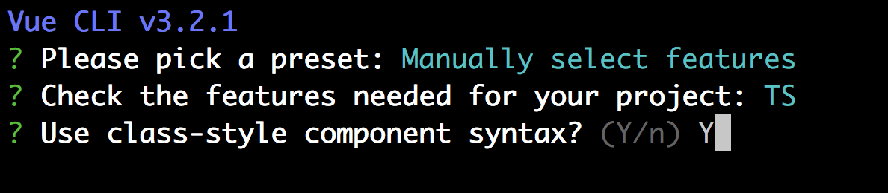
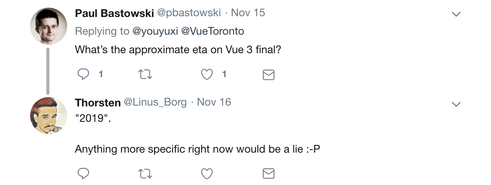

# Vue 3.0 and the future of Vue

> In today's article, we'll take a brief look at some of the cool features Vue 3.0 is expected to bring when it arrives.

Everything we’ve discussed within this course covers the latest current release of Vue, often labeled as [version 2.x](https://github.com/vuejs/vue/releases).

In [Sept. 2016](https://medium.com/the-vue-point/vue-2-0-is-here-ef1f26acf4b8), the Vue framework was rewritten and released as version 2.0. Vue 2.0 introduced new concepts such as a lightweight virtual DOM implementation, render functions, and server-side rendering capabilities. In addition, version 2.0 was rewritten to provide significant performance improvements over version 1.x.

Exactly two years later, Evan You published [Plans for the Next Iteration of Vue.js](https://medium.com/the-vue-point/plans-for-the-next-iteration-of-vue-js-777ffea6fabf), an article that summarizes a talk he gave at [Vue.js London](https://vuejs.london/summary/) presenting a sneak peek of what’s coming in the upcoming Vue release. At November 15th, 2018 and as the keynote speaker of [VueConfTO](https://vuetoronto.com/schedule/) - Evan took a deeper dive to explain some of the features Vue 3.0 would bring.

The [Plans for the Next Iteration of Vue.js](https://medium.com/the-vue-point/plans-for-the-next-iteration-of-vue-js-777ffea6fabf) article and Evan’s [slides from VueConf TO](https://docs.google.com/presentation/d/1yhPGyhQrJcpJI2ZFvBme3pGKaGNiLi709c37svivv0o/edit) are both stellar in their explanations. As a result, we won’t be going into _too much detail_ in this article but will summarize some of the cool updates coming with Vue 3.0!

## Vue 3.0

### Breaking changes

Though Vue 3.0 _will have_ some breaking changes, the good news is that the [Vue API will largely either remain the same or have a clear compatibility build with Vue 2.x](https://medium.com/the-vue-point/plans-for-the-next-iteration-of-vue-js-777ffea6fabf#f25a). [Scoped slots](https://vuejs.org/v2/guide/components-slots.html#Scoped-Slots) and the [native JavaScript process of writing `render()` functions](https://vuejs.org/v2/guide/render-function.html#Basics) are to experience some significant changes.

### Virtual DOM re-write (with TypeScript!)

The core [Virtual DOM source code implementation is getting a complete re-write with TypeScript](https://medium.com/the-vue-point/plans-for-the-next-iteration-of-vue-js-777ffea6fabf)! The Virtual DOM implementation is being re-written to [achieve 100% faster mounting and patching](https://docs.google.com/presentation/d/1yhPGyhQrJcpJI2ZFvBme3pGKaGNiLi709c37svivv0o/edit#slide=id.g42acc26207_0_108) which supports one of the main goals of making the Vue library _even faster then it is right now_.

The source code has moved away from using [Flow](https://flow.org/) to now instead use [TypeScript](https://www.typescriptlang.org/) as the main types interface. **This doesn't mean we will have to use TypeScript with Vue** but it does pave the way for improved TypeScript support in Vue 3.0!

I> TypeScript will be a prerequisite if you're interested in contributing to the Vue 3.0 source code directly 😛.

### IE11 Support

Vue 3.0 is to adapt a [Proxy based observation mechanism](https://developer.mozilla.org/en-US/docs/Web/JavaScript/Reference/Global_Objects/Proxy) for the detection and observation to changes within Vue instances. This is great because now, some of the caveats we’ve mentioned in this course like [the inability to add/delete new properties in an instance or directly mutate data arrays will no longer be a problem in Vue 3.0](https://medium.com/the-vue-point/plans-for-the-next-iteration-of-vue-js-777ffea6fabf#ba44)!

Since Proxy based observations aren’t compatible and can’t be transpiled for IE11, [a separate build will be available for developers building for IE11](https://medium.com/the-vue-point/plans-for-the-next-iteration-of-vue-js-777ffea6fabf#df62). This particular build will default to Vue 2.x’s [Object.defineProperty](https://developer.mozilla.org/en-US/docs/Web/JavaScript/Reference/Global_Objects/Object/defineProperty) API to detect Vue instance changes - which would result in having the same detection caveats that currently exist.

### Class Based Components

Class based components (which we haven’t really discussed in this course) will be getting first class support in Vue 3.0!

Class based components will involve using the [ES6 class](https://developer.mozilla.org/en-US/docs/Web/JavaScript/Reference/Classes) syntax to create a component instance. Here's an example of a class-based component, called `Hello`, that Evan originally displayed in his [Vue 3.0 Updates](https://docs.google.com/presentation/d/1yhPGyhQrJcpJI2ZFvBme3pGKaGNiLi709c37svivv0o/edit#slide=id.g4689c30700_0_35) presentation:

```javascript
interface HelloProps {
  text: string
}

class Hello extends Component<HelloProps> {
  count = 0
  render() {
    return <div>
      {this.count}
      {this.$props.text}
    </div>
  }
}
```

The `Hello` component above is constructed with the `class` syntax and extends a `Component` keyword. The component uses the `render()` function with JSX to create the markup of the component.

Some people prefer using the class-based syntax to construct components due to improved TypeScript declaration and having components be written in a more concise manner.

Though potentially different to what Vue 3.0 would bring: you can try out class-based components in Vue 2.x by scaffolding a Vue CLI project, selecting the Typescript feature, and answering ‘Yes’ to using a class-style component syntax. This will scaffold the project and allow the declaration of class components with the help of the  [`vue-class-component`](https://github.com/vuejs/vue-class-component) library.



### Exposed reactivity API

Vue 3.0 aims to _expose_ the reactivity observable API to allow developers to handle simple cross-component state management. Here’s a code snippet that Evan also shared in the [Vue 3.0 Updates](https://docs.google.com/presentation/d/1yhPGyhQrJcpJI2ZFvBme3pGKaGNiLi709c37svivv0o/edit#slide=id.g4689c30700_0_30) presentation that shows an example of how an observable/effect pattern can be pulled and directly used:

```javascript
import { observable, effect } from 'vue'

const state = observable({
 count: 0
})

effect(() => {
 console.log(`count is: ${state.count}`)
}) // count is: 0

state.count++ // count is: 1
```

In the example above, the `observable` and `effect` constructors are imported directly from the Vue library. A `state` object is created and set to an `observable` constructor that wraps an object containing a `count` variable set to 0. The `effect` constructor declares a call back function that has access to and console logs the `state.count` value. Whenever `state.count` is ever changed, the `effect` callback function runs!

Though this is a brief example, this shows us that having direct access to the exposed reactivity API could open the doors to allowing components share information in a really easy way!

## Conclusion

What we’ve talked about thus far are only some of the things that are in the pipeline with what Vue 3.0 is expected to bring. There are a whole slew of more advanced core changes being done to the library such as [Static Tree Hoisting](https://docs.google.com/presentation/d/1yhPGyhQrJcpJI2ZFvBme3pGKaGNiLi709c37svivv0o/edit#slide=id.g4689c30700_0_114), [Optimized Slots Generations](https://docs.google.com/presentation/d/1yhPGyhQrJcpJI2ZFvBme3pGKaGNiLi709c37svivv0o/edit#slide=id.g4689c30700_0_104), [Monomorphic Calls](https://docs.google.com/presentation/d/1yhPGyhQrJcpJI2ZFvBme3pGKaGNiLi709c37svivv0o/edit#slide=id.g4689c30700_0_93), etc. to help achieve the goals of having a _smaller_, _more manageable_, and _faster_ library.

The Vue team has mentioned that there are to be a [series of steps in the coming year](https://medium.com/the-vue-point/plans-for-the-next-iteration-of-vue-js-777ffea6fabf#4cbf) such as the Public Feedback via RFCs stage, Alpha Phase, and Beta Phase, before the library is launched. If you’re interested, keep your eyes peeled for these phases and be sure to read and check out the [Plans for the Next Iteration of Vue.js](https://medium.com/the-vue-point/plans-for-the-next-iteration-of-vue-js-777ffea6fabf) article and [Vue 3.0 Updates](https://docs.google.com/presentation/d/1yhPGyhQrJcpJI2ZFvBme3pGKaGNiLi709c37svivv0o/edit) slides for more details.

Now when _exactly_ is Vue 3.0 expected to launch? We know that it’ll be within sometime next year.



Though when exactly in the year is still a little too soon to say, we’ll be here to keep you up to date when it happens! We’ll see you tomorrow for the very last day of the course!
