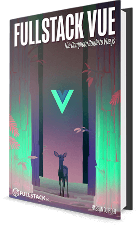

# Wrap-up and more resources

Welcome to the final day! Congrats! You've made it!

 

Photo by the talented [@ianjamesstauffer](https://www.instagram.com/ianjamesstauffer/)

We've covered a lot of material in the past 30 days. Some of the high-level topics we discussed are:

-   The Vue Instance and Data Reactivity
-   Vue Directives
-   The Vue Instance lifecycle
-   Vue Components and Single-File Components
-   How to use the `vue-cli` to bootstrap our apps
-   State management best practices
-   Client-side routing
-   Unit Testing

## There is so much more!

Although we covered a lot of topics in our first 30 days, there is so much more! How do we know? We wrote a [book](https://www.fullstack.io/vue/)! But before we talk about that… here are some resources we’ve found really useful in our journey working with Vue.

### The Vue Core Documentation

Link: <https://vuejs.org/v2/guide/>

The Vue core documentation have a reputation for being one of the best-written technical documentations out there… and for very good reason! Translated in seven languages, the Vue docs explains all the nifty details in a simple and clean manner.

### The Vue Style Guide

Link: <https://vuejs.org/v2/style-guide/>

The Vue Style Guide is the official style guide for Vue specific code and provides a set of standards that help avoid errors and general anti-patterns.

### The Vue Cookbook

Link: <https://vuejs.org/v2/cookbook/>

The Vue Cookbook differentiates from the core documentation by highlighting ‘recipes’ that dive in to certain topics in a broader sense (for e.g. [how do we package Vue Components for npm?](https://vuejs.org/v2/cookbook/packaging-sfc-for-npm.html)).

### Vue Mastery

Link: <https://www.vuemastery.com/>

A learning resource for Vue developers helmed by the ever talented [Gregg Pollack](https://twitter.com/greggpollack) and [Adam Jahr](https://twitter.com/AdamJahr). The Vue Mastery video courses are crisply composed with engaging graphics to help guide viewers to understand all the ins and outs of the Vue framework.

I> Gregg and Adam also co-produce the [official Vue.js News and Podcast](https://news.vuejs.org/)!

### Vue Land - The Vue Discord Channel

Link: <https://vue-land.js.org/>

The Vue Discord channel is a fantastic hang-out spot consisting of some of the core team members, contributors, and other developers. Have a question or want to stay up to date with announcements? Hang out at Vue Land!

and...

### Fullstack Vue

 

Did you happen to enjoy this course and are interested in going deeper with Vue, with us? Check out [Fullstack Vue](https://www.fullstack.io/vue)! Not only do we cover **in-depth** the topics we briefly introduced in this 30 days, we go into plenty of other content, including (but not limited to):

-   Proven patterns to building large-scale Vue apps from scratch.
-   Integrating Vuex to a server-persisted app.
-   Advanced routing with dynamic route matching, navigation guards, and authenticated routes.
-   An in-depth review of unit testing which involve testing components in a Vue Router and Vuex integrated setting.
-   Forms forms forms! We cover form validations, from basic form inputs through validating and integrating with Vuex.
-   For the full package - access to a series of videos, almost 2hrs in length, to _set up_, _build_, and _deploy_ an **entire Vue.js application** from scratch - [check out the app here](http://simplecoincap.com/)!
-   And much much more.

All the above are all done within the context of building **much larger applications** as well. Check out the book page at [www.fullstack.io/vue](https://www.fullstack.io/vue) for more details.

With that said, congrats on making it to day 30! We look forward to see what you all accomplish with Vue 🎉.
