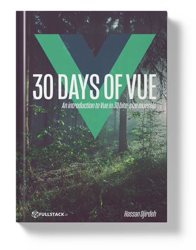

# Introduction

Hello!

Welcome to __Fullstack's 30 Days of Vue__ - an introduction to the Vue framework in 30 bite-sized morsels.

  

My name's [Hassan](https://twitter.com/djirdehh) and I'm a Front End Engineer based in Toronto, Canada. I fell in love with Vue a few years ago and have spent a lot of my free time [compiling blogs about certain topics](https://medium.com/fullstackio) within the framework, [giving talks](https://www.youtube.com/watch?v=B7g7MOrDtMY), [holding workshops](https://vuetraining.fullstack.io/), and writing the book [Fullstack Vue](https://www.fullstack.io/vue/).

If you've never used Vue before and are interested in getting started, welcome! I always encourage newcomers to first peruse the [Vue Documentation](https://vuejs.org/v2/guide/installation.html) since the Vue Docs are often known to be some of the best-written documentation out there. In the general JavaScript ecosystem, I've personally found that a large number of external learning resources tend to assume the reader has some prior knowledge about certain concepts. With 30 Days of Vue, I've attempted to make this resource __as welcoming as possible for complete newcomers__. We'll be keeping everything as _lightweight_ as possible and look to demonstrate concepts with simple to follow examples. If you're already familiar with HTML, CSS, and have a little understanding of JavaScript - you've come to the right place!

In 30 Days of Vue, we'll be walking through some of the common bells and whistles that exist in modern web development (e.g. __data-driven UI__, __reusable web components__, the __Flux architecture__, __Webpack based projects__, etc.) all within one of the fastest growing JavaScript frameworks today - Vue.js.

I really hope you enjoy going through this material as much as I enjoyed compiling it. I'll be doing my best to keeping this resource up to date so if you have any questions, feedback, and/or would like to contribute - you're always welcome to reach out through the [Github Repo](https://github.com/fullstackio/30-days-of-vue). You can always drop us an email at [us@fullstack.io](us@fullstack.io) or reach out to me on Twitter - [@djirdehh](https://twitter.com/djirdehh).

Cheers!
Hassan Djirdeh
